<p align="center">
  
</p>

<h1 align="center">Auth Service</h1>

<p align="center">
  <strong>Enterprise-grade authentication. Zero compromise.</strong>
</p>

<p align="center">
  <a href="#"></a>
  <a href="#"></a>
  <a href="#"></a>
  <a href="#"></a>
  <a href="#"></a>
  <a href="#"></a>
  <a href="#"></a>
</p>

<p align="center">
  <a href="#features">Features</a> •
  <a href="#tech-stack">Tech Stack</a> •
  <a href="#architecture">Architecture</a> •
  <a href="#getting-started">Getting Started</a> •
  <a href="#api">API</a> •
  <a href="#roadmap">Roadmap</a>
</p>

---

## Mission

> **Secure authentication infrastructure for modern applications.**
> Built for scale, designed for developers, engineered for security.

---

## Tech Stack

<table>
<tr>
<td align="center" width="96">
  
  <br><strong>Python 3.11</strong>
</td>
<td align="center" width="96">
  
  <br><strong>FastAPI</strong>
</td>
<td align="center" width="96">
  
  <br><strong>PostgreSQL</strong>
</td>
<td align="center" width="96">
  
  <br><strong>Redis</strong>
</td>
<td align="center" width="96">
  
  <br><strong>Docker</strong>
</td>
<td align="center" width="96">
  
  <br><strong>K8s</strong>
</td>
</tr>
<tr>
<td align="center" width="96">
  
  <br><strong>Stripe</strong>
</td>
<td align="center" width="96">
  
  <br><strong>Google OAuth</strong>
</td>
<td align="center" width="96">
  
  <br><strong>JWT</strong>
</td>
<td align="center" width="96">
  
  <br><strong>CI/CD</strong>
</td>
<td align="center" width="96">
  
  <br><strong>Datadog</strong>
</td>
<td align="center" width="96">
  
  <br><strong>Monitoring</strong>
</td>
</tr>
</table>

---

## Features

| Feature | Description |
|---------|-------------|
| **JWT Authentication** | Secure token-based auth with configurable expiration |
| **Google OAuth 2.0** | One-click social login integration |
| **Stripe Payments** | Subscriptions, credits, and webhook handling |
| **Rate Limiting** | Per-endpoint protection against abuse |
| **Request Tracing** | Distributed tracing with X-Request-ID |
| **Security Headers** | XSS, clickjacking, MIME sniffing protection |
| **API Versioning** | `/v1/*` routes with backward compatibility |
| **Health Probes** | Kubernetes-ready liveness & readiness checks |
| **Graceful Shutdown** | Zero-downtime deployments |
| **Secrets Validation** | Startup validation with severity levels |

---

## Architecture

### System Overview

```mermaid
flowchart TB
    subgraph Clients["👥 Clients"]
        WEB["🌐 Web App"]
        MOB["📱 Mobile App"]
        SVC["⚙️ Services"]
    end

    subgraph Gateway["🛡️ API Gateway"]
        LB["Load Balancer"]
        RL["Rate Limiter"]
    end

    subgraph Auth["🔐 Auth Service"]
        API["FastAPI"]
        MW["Middleware Stack"]
        BL["Business Logic"]
    end

    subgraph Data["💾 Data Layer"]
        PG[("PostgreSQL")]
        RD[("Redis Cache")]
    end

    subgraph External["🌍 External"]
        GOOGLE["Google OAuth"]
        STRIPE["Stripe API"]
        EMAIL["SendGrid"]
    end

    WEB & MOB & SVC --> LB
    LB --> RL --> API
    API --> MW --> BL
    BL --> PG & RD
    BL <--> GOOGLE & STRIPE & EMAIL

    style Auth fill:#1a1a2e,stroke:#7C4DFF,stroke-width:2px
    style Data fill:#1a1a2e,stroke:#00E676,stroke-width:2px
    style External fill:#1a1a2e,stroke:#FF6D00,stroke-width:2px
```



### Authentication Flow


### Middleware Pipeline

```mermaid
flowchart LR
    REQ["📥 Request"] --> RID["Request ID"]
    RID --> SEC["Security Headers"]
    SEC --> CORS["CORS"]
    CORS --> RATE["Rate Limit"]
    RATE --> TIMEOUT["Timeout"]
    TIMEOUT --> AUTH["🔐 Auth"]
    AUTH --> HANDLER["Handler"]
    HANDLER --> RES["📤 Response"]

    style REQ fill:#7C4DFF,stroke:#fff,color:#fff
    style RES fill:#00E676,stroke:#fff,color:#000
    style AUTH fill:#FF6D00,stroke:#fff,color:#fff
```



### Deployment View


---

## Getting Started

### Prerequisites

```bash
python >= 3.11
postgresql >= 13
docker (optional)
```

### Quick Start

```bash
# Clone
git clone https://github.com/AIgen-Solutions-s-r-l/fastapi-auth-service.git
cd fastapi-auth-service

# Install
poetry install

# Configure
cp .env.example .env
# Edit .env with your settings

# Migrate
alembic upgrade head

# Run
uvicorn app.main:app --reload --port 8080
```

### Docker

```bash
# Build & Run
docker build -t auth-service .
docker run -p 8080:8080 --env-file .env auth-service
```

---

## API

### Versioned Endpoints

| Method | Endpoint | Auth | Description |
|--------|----------|------|-------------|
| `POST` | `/v1/auth/register` | - | Create account |
| `POST` | `/v1/auth/login` | - | Get JWT token |
| `POST` | `/v1/auth/refresh` | JWT | Refresh token |
| `GET` | `/v1/auth/me` | JWT ✓ | Get profile |
| `GET` | `/v1/auth/oauth/google` | - | Google OAuth |
| `GET` | `/v1/credits/balance` | API Key | Check balance |
| `POST` | `/v1/webhooks/stripe` | Signature | Stripe events |

### Health Checks

```bash
GET /healthcheck/live   # Liveness probe
GET /healthcheck/ready  # Readiness probe
GET /healthcheck/full   # Detailed status
```

### API Versions

```bash
GET /api/versions
```

```json
{
  "current_version": "v1",
  "supported_versions": [{"version": "v1", "status": "stable"}]
}
```

---

## Security

| Layer | Protection |
|-------|------------|
| **Transport** | HTTPS, TLS 1.3 |
| **Headers** | X-Frame-Options, CSP, HSTS |
| **Auth** | JWT RS256, bcrypt passwords |
| **Input** | Validation, sanitization |
| **Rate Limit** | 100 req/min (auth), 1000 req/min (api) |
| **Timeout** | 30s request timeout |
| **Secrets** | Startup validation, no defaults in prod |

---

## Roadmap

| Priority | Feature | Status |
|----------|---------|--------|
| `P1` | Multi-tenant support | 🔜 Planned |
| `P1` | WebAuthn/Passkeys | 🔜 Planned |
| `P2` | MFA/2FA | 🔜 Planned |
| `P2` | Audit logging | 🔜 Planned |
| `P3` | Admin dashboard | 📋 Backlog |
| `P3` | GraphQL API | 📋 Backlog |

---

## Contributing

```bash
# Fork & Clone
git clone https://github.com/YOUR_USERNAME/fastapi-auth-service.git

# Branch
git checkout -b feature/amazing-feature

# Commit
git commit -m "feat: add amazing feature"

# Push & PR
git push origin feature/amazing-feature
```

**Guidelines:**
- Follow [Conventional Commits](https://conventionalcommits.org)
- Write tests for new features
- Update documentation as needed

---

## License

```
MIT License

Copyright (c) 2025 AIgen Solutions s.r.l.

Permission is hereby granted, free of charge, to any person obtaining a copy
of this software and associated documentation files (the "Software"), to deal
in the Software without restriction, including without limitation the rights
to use, copy, modify, merge, publish, distribute, sublicense, and/or sell
copies of the Software, and to permit persons to whom the Software is
furnished to do so, subject to the following conditions:

The above copyright notice and this permission notice shall be included in all
copies or substantial portions of the Software.
```

---

<p align="center">
  <strong>Built with ❤️ by <a href="https://github.com/AIgen-Solutions-s-r-l">AIgen Solutions</a></strong>
</p>

<p align="center">
  <a href="#top">⬆️ Back to Top</a>
</p>
