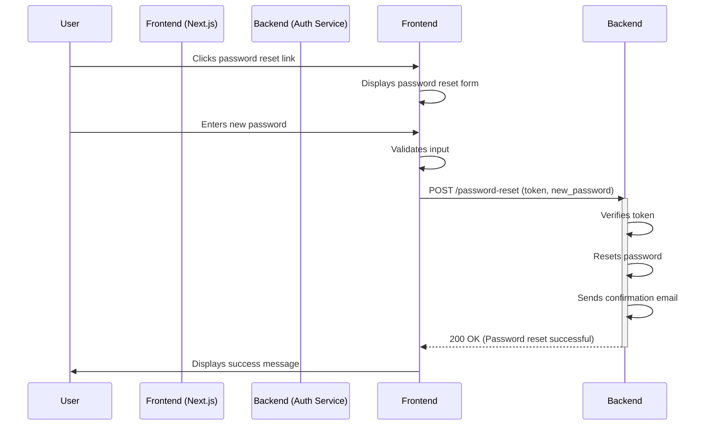
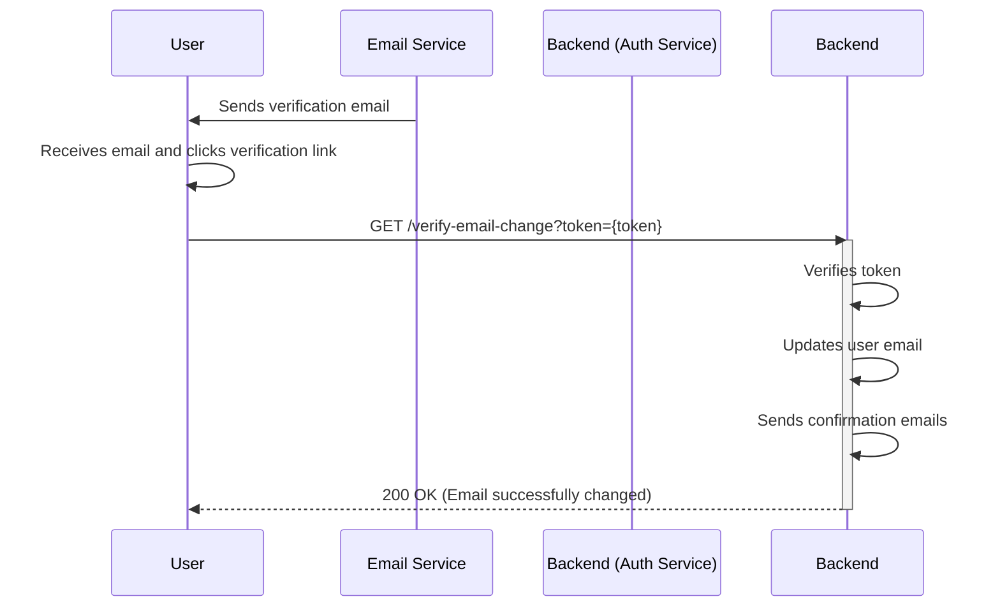
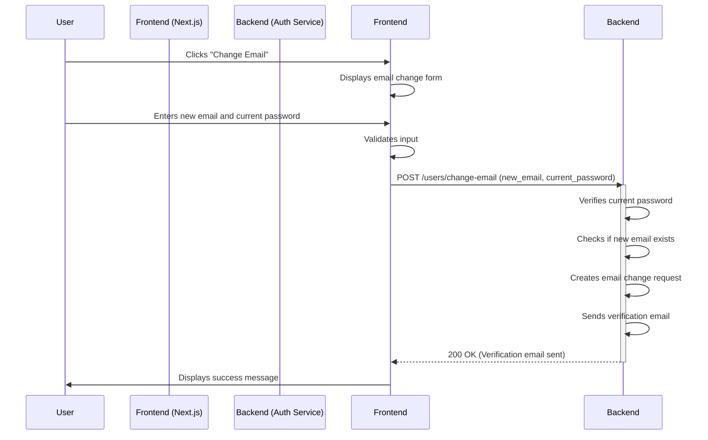
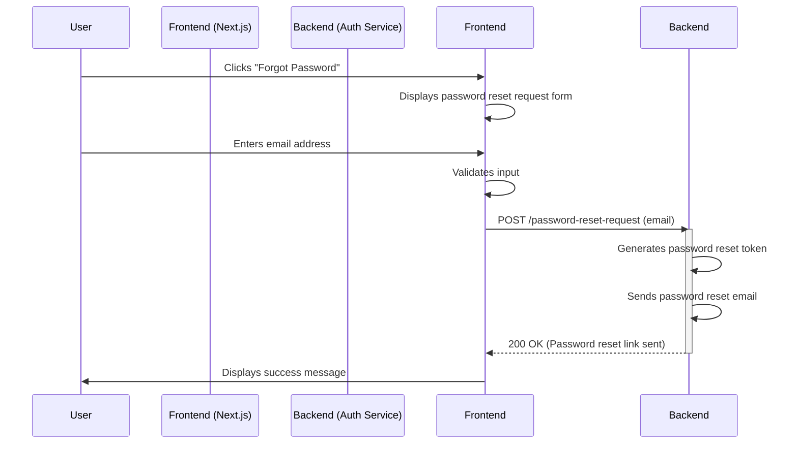

# Authentication Flows - Frontend Developer Guide

## Code Analysis

This section analyzes the relevant backend code snippets to understand the authentication flows.

### Authentication Modules

The core authentication logic is handled in `app/core/auth.py`. This file contains the `get_current_user` and `get_current_active_user` dependencies, which are used to authenticate and authorize users based on JWT tokens. The `oauth2_scheme` is used for JWT token handling.
## Security Considerations (Detailed)
## Error Handling and User Experience
## Testing and Validation
## Code Style and Conventions

*   [To be completed - Mention the project's coding style guidelines (if any).]

## Version Control and Documentation

*   Use a version control system (e.g., Git) to manage the code.
*   Commit changes with clear and concise commit messages.
*   Document the code thoroughly using comments and docstrings.
*   Follow the project's documentation guidelines.


This section outlines testing strategies to ensure the robustness and reliability of the implemented flows.

### Unit Tests

*   Write unit tests for individual functions and components, such as input validation, password hashing, and token generation.
*   Use a testing framework (e.g., pytest) to write and run the tests.
*   Mock external dependencies (e.g., database, email service) to isolate the components being tested.

### Integration Tests

*   Write integration tests to verify the interaction between different components, such as the frontend and backend API endpoints.
*   Test the complete flows, including email change and password reset.
*   Use a testing framework (e.g., pytest) to write and run the tests.

### End-to-End Tests

*   Write end-to-end tests to simulate user interactions and verify the complete flows from the user's perspective.
*   Use a testing framework (e.g., Cypress, Playwright) to automate the tests.
*   Test the email change and password reset flows, including the email verification and password reset steps.


This section provides recommendations for handling potential errors gracefully and providing a positive user experience.

### Clear and Informative Error Messages

*   Provide clear and informative error messages to the user, explaining the reason for the error and how to resolve it.
*   Use specific error messages for different error scenarios (e.g., "Invalid email format", "Incorrect password", "Email already in use").
*   Avoid generic error messages that do not provide enough information to the user.

### Progress Indicators and Loading States

*   Use progress indicators (e.g., loading spinners) to indicate that a request is in progress.
*   Disable buttons during API calls to prevent multiple submissions.
*   Provide feedback to the user after a successful operation (e.g., a success message).

### Accessibility Considerations

*   Ensure that the forms and error messages are accessible to users with disabilities.
*   Use appropriate ARIA attributes to improve accessibility.
*   Provide alternative text for images.


This section provides a detailed overview of the security considerations for the email change and password reset flows.

### Input Validation and Sanitization

*   **Email Validation:** The frontend and backend should validate the email format using appropriate regular expressions or email validation libraries. The backend uses Pydantic's `EmailStr` for validation.
*   **Password Validation:** The frontend should validate the password strength (minimum length, complexity). The backend should also validate the password strength and reject weak passwords. The backend uses Pydantic's validation for password length.
*   **Sanitization:** Input should be sanitized to prevent injection attacks. This includes escaping special characters and using parameterized queries when interacting with the database.

### Protection Against XSS and CSRF Attacks

*   **XSS (Cross-Site Scripting):** The frontend should properly escape user-provided data before displaying it to prevent XSS attacks. The backend should set the `Content-Security-Policy` header to mitigate XSS risks.
*   **CSRF (Cross-Site Request Forgery):** Implement CSRF protection by using a CSRF token in forms and API requests. The token should be generated on the server-side and included in the frontend forms. The backend should validate the CSRF token for each request.

### Secure Password Storage and Hashing

*   **Bcrypt:** Use bcrypt for secure password hashing with automatic salt generation. The salt should be generated uniquely for each password and stored with the hash. The project uses bcrypt for password hashing in `app/core/security.py`.
*   **Password Storage:** Never store passwords in plaintext or logs.
*   **Constant-Time Comparison:** Use constant-time comparison functions to prevent timing attacks during password verification.

### Rate Limiting and Account Lockout Mechanisms

*   **Rate Limiting:** Implement rate limiting on authentication endpoints (e.g., login, password reset request) to prevent brute-force attacks. The project implements rate limiting as described in the `README.md`.
*   **Account Lockout:** Implement account lockout mechanisms after a certain number of failed login attempts to protect against brute-force attacks.

### Email Verification Best Practices

*   **DKIM, SPF, DMARC:** Implement DKIM, SPF, and DMARC to improve email deliverability and prevent email spoofing.
*   **Token Expiration:** Set an expiration time for email verification and password reset tokens.
*   **HTTPS:** Always use HTTPS to secure the communication between the frontend and backend.


### API Interaction

The API endpoints for email change and password reset are defined in `app/routers/auth/email_management.py` and `app/routers/auth/password_management.py`, respectively. These routers handle the requests, validate the input, interact with the database, and send emails.

### Error Handling

The project uses a centralized error handling mechanism. Custom exceptions are defined in `app/core/db_exceptions.py` to handle specific error scenarios. The `app/core/error_handlers.py` file contains the exception handlers that are used to catch and handle these exceptions. The error handling strategy includes logging, returning appropriate HTTP status codes, and sanitizing error details to avoid exposing sensitive information.

### Security

The project implements several security best practices, including:

*   **Password Hashing:** Passwords are securely hashed using bcrypt with automatic salt generation in `app/core/security.py`.
*   **Input Validation:** Input validation is performed using Pydantic models in `app/schemas/auth_schemas.py`.
*   **JWT Authentication:** JWT tokens are used for authentication, with configurable expiration times.
*   **Rate Limiting:** Rate limiting is implemented to prevent abuse (as described in the `README.md`).
*   **Email Verification:** Email verification is used to confirm the user's email address.

## Introduction

This document provides a comprehensive guide for frontend developers on the user flows for email address modification and password reset functionalities within the authentication service. It covers code analysis, user flow diagrams, step-by-step instructions, security considerations, error handling, and testing strategies.

## Code Analysis

[To be completed - Analyze relevant frontend code snippets (if available). Focus on authentication modules, form validation, API interaction, and error handling. Identify potential vulnerabilities, best practices, and areas for optimization.]

## Email Change User Flow

### Initiating Email Change (from User Profile)

*   **User Action:** The user clicks a "Change Email" button within their user profile settings.
*   **Mermaid Diagram:**
```mermaid
sequenceDiagram
    participant User
    participant Frontend (Next.js)
    participant Backend (Auth Service)

    User->>Frontend: Clicks "Change Email"
    Frontend->>Frontend: Displays email change form
    User->>Frontend: Enters new email and current password
    Frontend->>Frontend: Validates input
    Frontend->>Backend: POST /users/change-email (new_email, current_password)
    activate Backend
    Backend->>Backend: Verifies current password
    Backend->>Backend: Checks if new email exists
    Backend->>Backend: Creates email change request
    Backend->>Backend: Sends verification email
    Backend-->>Frontend: 200 OK (Verification email sent)
## Password Reset User Flow

### Password Reset Initiation (Forgot Password)

*   **User Action:** The user clicks a "Forgot Password" link.
*   **Mermaid Diagram:**
```mermaid
sequenceDiagram
    participant User
    participant Frontend (Next.js)
    participant Backend (Auth Service)

    User->>Frontend: Clicks "Forgot Password"
    Frontend->>Frontend: Displays password reset request form
    User->>Frontend: Enters email address
    Frontend->>Frontend: Validates input
    Frontend->>Backend: POST /password-reset-request (email)
    activate Backend
    Backend->>Backend: Generates password reset token
    Backend->>Backend: Sends password reset email
    Backend-->>Frontend: 200 OK (Password reset link sent)
    deactivate Backend
    Frontend->>User: Displays success message
```
*   **Frontend Implementation (Next.js and axios):**
    *   Create a form with the following fields:
        *   New Email (input type="email")
        *   Current Password (input type="password")
        *   Submit button
    *   Use the `axios` library to make a `PUT` request to the `/users/change-email` endpoint.
    *   Handle the response from the API. Display success or error messages to the user.

    ```javascript
    import axios from 'axios';

    async function handleChangeEmail(newEmail, currentPassword) {
      try {
        const response = await axios.put('/api/users/change-email', {
          new_email: newEmail,
          current_password: currentPassword,
        });

        if (response.status === 200) {
          // Email change request successful
          alert('Verification email sent. Please check your inbox.');
          // Optionally, redirect the user or update the UI.
        } else {
          // Handle other status codes (e.g., 400, 401)
          alert(response.data.message || 'An error occurred.');
        }
      } catch (error) {
        // Handle network errors or other exceptions
        console.error('Error changing email:', error);
        alert(error.response?.data?.message || 'An unexpected error occurred.');
      }
    }
    ```
    *   Ensure the user is authenticated before allowing them to change their email. You can use a JWT token stored in a cookie or local storage.

*   **Frontend Implementation (Next.js and axios):**
    *   [To be completed - Step-by-step instructions and code examples for the frontend implementation, including form creation, input validation, and API call using axios.]
*   **Backend API Endpoint:** `/password-reset-request` (from `app/routers/auth/password_management.py`)
*   **Security Considerations:**
    *   Rate limiting.
    *   Email address validation.

### Password Reset Link Generation and Delivery

*   **User Action:** The user receives an email with a password reset link.
*   **Mermaid Diagram:** (See diagram in Password Reset Initiation)
*   **Backend Logic for Generating the Reset Token:** (from `app/services/user_service.py`)
    *   [To be completed - Describe the token generation logic.]
*   **Email Template Design Considerations:** (referencing the templates in `app/templates/`) 
    *   [To be completed - Discuss email template design, including branding, and dynamic content.]
*   **Security Considerations:**
    *   Token generation (secure random). 
    *   Token expiration.

### Password Reset Form and Validation

*   **User Action:** The user clicks the password reset link and enters a new password.
*   **Mermaid Diagram:**

*   **Frontend Implementation (Next.js and axios):**
    *   [To be completed - Step-by-step instructions and code examples for the frontend implementation, including API call using axios.]
*   **Backend API Endpoint:** `/password-reset` (from `app/routers/auth/password_management.py`)
*   **Security Considerations:**
    *   Input validation (password strength).
    *   CSRF protection (if applicable).

### Successful Password Reset and Redirection

*   **User Action:** The user submits the new password.
*   **Mermaid Diagram:** (See diagram in Password Reset Form and Validation)
*   **Security Considerations:**
    *   Token validation.
    *   Password hashing.
*   **Backend Email Sending Logic:** (from `app/services/email_service.py`)
    *   The `EmailService` class is responsible for sending emails. The `send_email_change_verification` method is used to send the verification email.
    *   The `send_email_change_verification` method takes the user object, the new email address, and the verification token as input.
    *   It constructs the verification link using the frontend URL and the verification token.
    *   It calls the `_send_templated_email` method to send the email using the `email_change_verification` template.

    ```python
    # Example from app/services/email_service.py
    async def send_email_change_verification(
        self,
        user: User,
        new_email: str,
        verification_token: str
    ) -> None:
        verification_link = f"{settings.FRONTEND_URL}/verify-email-change?token={verification_token}"

        await self._send_templated_email(
            template_name="email_change_verification",
            subject="Verify Your New Email Address",
            recipients=[str(new_email)],  # Send to the new email address
            context={
                "email": new_email,
                "verification_link": verification_link,
                "hours_valid": 24  # Token validity in hours
            }
        )
    ```

*   **Error Handling:**
    *   Invalid token.
    *   Expired token.

    deactivate Backend
    Frontend->>User: Displays success message
```
*   **Frontend Implementation (Next.js and axios):**
    *   [To be completed - Step-by-step instructions and code examples for the frontend implementation, including form creation, input validation, and API call using axios.]
*   **Backend API Endpoint:** `/users/change-email` (from `app/routers/auth/email_management.py`)
*   **Security Considerations:**
    *   Input validation (email format, password strength).
    *   CSRF protection (if applicable).
    *   Rate limiting.

### Email Verification Process

*   **User Action:** The user receives an email with a verification link and clicks it.
*   **Mermaid Diagram:**

*   **Backend Email Sending Logic:** (from `app/services/email_service.py`)
    *   [To be completed - Describe the email sending logic, referencing the `EmailService` class and email templates.]
*   **Email Template Design Considerations:** (referencing the templates in `app/templates/`)
    *   [To be completed - Discuss email template design, including branding, and dynamic content.]
*   **Security Considerations:**
    *   DKIM, SPF, DMARC (if implemented).
    *   Token expiration.

### Confirmation and Completion of Email Change

*   **User Action:** The user clicks the verification link in the email.
*   **Mermaid Diagram:** (See diagram in Email Verification Process)
*   **Frontend Implementation (Next.js and axios):**
    *   [To be completed - Step-by-step instructions and code examples for the frontend implementation, including API call using axios.]
*   **Backend API Endpoint:** `/verify-email-change` (from `app/routers/auth/email_management.py`)
*   **Security Considerations:**
    *   Token validation.
    *   Access token generation.
*   **Error Handling:**
    *   Invalid token.
    *   Expired token.

### Initiating Email Change (from User Profile)
*   **Frontend Implementation (Next.js and axios):**
    *   The user clicks the verification link in the email, which redirects them to a verification page.
    *   Use the `axios` library to make a `GET` request to the `/verify-email-change` endpoint, passing the token as a query parameter.
    *   Handle the response from the API. Display success or error messages to the user.

    ```javascript
    import axios from 'axios';
    import { useRouter } from 'next/router';

    function VerifyEmail() {
      const router = useRouter();
      const { token } = router.query;

      useEffect(() => {
        async function verifyEmail() {
          if (!token) return;
          try {
            const response = await axios.get(`/api/verify-email-change?token=${token}`);
            if (response.status === 200) {
              // Email successfully verified
              alert('Email address successfully changed and verified!');
              // Optionally, redirect the user to the profile page or login page.
            } else {
              alert(response.data.message || 'An error occurred.');
            }
          } catch (error) {
            console.error('Error verifying email:', error);
            alert(error.response?.data?.message || 'An unexpected error occurred.');
          }
        }
        verifyEmail();
      }, [token]);

      return (
*   **Frontend Implementation (Next.js and axios):**
    *   Create a form with the following field:
        *   Email Address (input type="email")
        *   Submit button
    *   Use the `axios` library to make a `POST` request to the `/password-reset-request` endpoint.
    *   Handle the response from the API. Display success or error messages to the user.

    ```javascript
    import axios from 'axios';

    async function handleForgotPassword(email) {
*   **Backend Logic for Generating the Reset Token:** (from `app/services/user_service.py`)
    *   The `create_password_reset_token` function is responsible for generating the reset token.
    *   It takes the user's email as input.
    *   It generates a unique token and stores it in the database, associated with the user.
    *   The token is valid for a specific duration (e.g., 24 hours).

    ```python
    # Example from app/services/user_service.py
    async def create_password_reset_token(
        db: AsyncSession, email: str
    ) -> str:
        # Find the user by email
        result = await db.execute(select(User).where(User.email == email))
        user = result.scalar_one_or_none()

        if not user:
            raise UserNotFoundError("User not found")

        # Generate a unique token
        token = secrets.token_hex(32)

        # Store the token in the database
        # (Implementation details for storing the token and setting expiration)

        return token
    ```

      try {
        const response = await axios.post('/api/password-reset-request', {
          email: email,
        });
*   **Frontend Implementation (Next.js and axios):**
    *   The user clicks the password reset link, which redirects them to a password reset form.
    *   Create a form with the following fields:
        *   New Password (input type="password")
        *   Confirm New Password (input type="password")
        *   Submit button
    *   Use the `axios` library to make a `POST` request to the `/password-reset` endpoint, passing the token (from the URL) and the new password.
    *   Handle the response from the API. Display success or error messages to the user.

    ```javascript
    import axios from 'axios';
    import { useRouter } from 'next/router';
    import { useState, useEffect } from 'react';

    function ResetPassword() {
      const router = useRouter();
      const { token } = router.query;
      const [newPassword, setNewPassword] = useState('');
## Security Considerations (Detailed)

This section provides a detailed overview of the security considerations for the email change and password reset flows.

## Error Handling and User Experience

This section provides recommendations for handling potential errors gracefully and providing a positive user experience.

## Testing and Validation

This section outlines testing strategies to ensure the robustness and reliability of the implemented flows.

## Code Style and Conventions

*   [To be completed - Mention the project's coding style guidelines (if any).]

## Version Control and Documentation

*   Use a version control system (e.g., Git) to manage the code.
*   Commit changes with clear and concise commit messages.
*   Document the code thoroughly using comments and docstrings.
*   Follow the project's documentation guidelines.

### Unit Tests

*   Write unit tests for individual functions and components, such as input validation, password hashing, and token generation.
*   Use a testing framework (e.g., pytest) to write and run the tests.
*   Mock external dependencies (e.g., database, email service) to isolate the components being tested.

### Integration Tests

*   Write integration tests to verify the interaction between different components, such as the frontend and backend API endpoints.
*   Test the complete flows, including email change and password reset.
*   Use a testing framework (e.g., pytest) to write and run the tests.

### End-to-End Tests

*   Write end-to-end tests to simulate user interactions and verify the complete flows from the user's perspective.
*   Use a testing framework (e.g., Cypress, Playwright) to automate the tests.
*   Test the email change and password reset flows, including the email verification and password reset steps.

### Clear and Informative Error Messages

*   Provide clear and informative error messages to the user, explaining the reason for the error and how to resolve it.
*   Use specific error messages for different error scenarios (e.g., "Invalid email format", "Incorrect password", "Email already in use", "Invalid token", "Expired token").
*   Avoid generic error messages that do not provide enough information to the user.

### Progress Indicators and Loading States

*   Use progress indicators (e.g., loading spinners) to indicate that a request is in progress.
*   Disable buttons during API calls to prevent multiple submissions.
*   Provide feedback to the user after a successful operation (e.g., a success message).

### Accessibility Considerations

*   Ensure that the forms and error messages are accessible to users with disabilities.
*   Use appropriate ARIA attributes to improve accessibility.
*   Provide alternative text for images.

### Input Validation and Sanitization

*   **Email Validation:** The frontend and backend should validate the email format using appropriate regular expressions or email validation libraries. The backend uses Pydantic's `EmailStr` for validation.
*   **Password Validation:** The frontend should validate the password strength (minimum length, complexity). The backend should also validate the password strength and reject weak passwords. The backend uses Pydantic's validation for password length.
*   **Sanitization:** Input should be sanitized to prevent injection attacks. This includes escaping special characters and using parameterized queries when interacting with the database.

### Protection Against XSS and CSRF Attacks

*   **XSS (Cross-Site Scripting):** The frontend should properly escape user-provided data before displaying it to prevent XSS attacks. The backend should set the `Content-Security-Policy` header to mitigate XSS risks.
*   **CSRF (Cross-Site Request Forgery):** Implement CSRF protection by using a CSRF token in forms and API requests. The token should be generated on the server-side and included in the frontend forms. The backend should validate the CSRF token for each request.

### Secure Password Storage and Hashing

*   **Bcrypt:** Use bcrypt for secure password hashing with automatic salt generation. The salt should be generated uniquely for each password and stored with the hash. The project uses bcrypt for password hashing in `app/core/security.py`.
*   **Password Storage:** Never store passwords in plaintext or logs.
*   **Constant-Time Comparison:** Use constant-time comparison functions to prevent timing attacks during password verification.

### Rate Limiting and Account Lockout Mechanisms

*   **Rate Limiting:** Implement rate limiting on authentication endpoints (e.g., login, password reset request) to prevent brute-force attacks. The project implements rate limiting as described in the `README.md`.
*   **Account Lockout:** Implement account lockout mechanisms after a certain number of failed login attempts to protect against brute-force attacks.

### Email Verification Best Practices

*   **DKIM, SPF, DMARC:** Implement DKIM, SPF, and DMARC to improve email deliverability and prevent email spoofing.
*   **Token Expiration:** Set an expiration time for email verification and password reset tokens. The email change and password reset tokens have a 24-hour expiration time.
*   **HTTPS:** Always use HTTPS to secure the communication between the frontend and backend.

      const [confirmPassword, setConfirmPassword] = useState('');
      const [message, setMessage] = useState('');
      const [error, setError] = useState('');

      useEffect(() => {
        if (!token) {
          setError('Invalid token.');
        }
      }, [token]);

      async function handleResetPassword(e) {
        e.preventDefault();
        if (newPassword !== confirmPassword) {
          setError('Passwords do not match.');
          return;
        }

        try {
          const response = await axios.post('/api/password-reset', {
            token: token,
            new_password: newPassword,
          });

          if (response.status === 200) {
            setMessage('Password reset successfully!');
            // Optionally, redirect the user to the login page.
          } else {
            setError(response.data.message || 'An error occurred.');
          }
        } catch (error) {
          console.error('Error resetting password:', error);
          setError(error.response?.data?.message || 'An unexpected error occurred.');
        }
      }

      return (
        <div>
          {error && <p style={{ color: 'red' }}>{error}</p>}
          {message && <p style={{ color: 'green' }}>{message}</p>}
          <form onSubmit={handleResetPassword}>
            <label htmlFor="newPassword">New Password:</label>
            <input
              type="password"
              id="newPassword"
              value={newPassword}
              onChange={(e) => setNewPassword(e.target.value)}
            />
            <br />
            <label htmlFor="confirmPassword">Confirm Password:</label>
            <input
              type="password"
              id="confirmPassword"
              value={confirmPassword}
              onChange={(e) => setConfirmPassword(e.target.value)}
            />
            <br />
            <button type="submit">Reset Password</button>
          </form>
        </div>
      );
    }
    ```


        if (response.status === 200) {
          // Password reset request successful
          alert('If an account with that email exists, a password reset link has been sent.');
          // Optionally, redirect the user or update the UI.
        } else {
          // Handle other status codes (e.g., 400)
          alert(response.data.message || 'An error occurred.');
        }
      } catch (error) {
        // Handle network errors or other exceptions
        console.error('Error requesting password reset:', error);
        alert(error.response?.data?.message || 'An unexpected error occurred.');
      }
    }
    ```

        <div>
          <p>Verifying your email...</p>
        </div>
      );
    }
    ```


*   **User Action:** The user clicks a "Change Email" button within their user profile settings.
*   **Mermaid Diagram:**

*   **Frontend Implementation (Next.js and axios):**
    *   [To be completed - Step-by-step instructions and code examples for the frontend implementation, including form creation, input validation, and API call using axios.]
*   **Backend API Endpoint:** `/users/change-email` (from `app/routers/auth/email_management.py`)
*   **Security Considerations:**
    *   Input validation (email format, password strength).
    *   CSRF protection (if applicable).
    *   Rate limiting.

### Email Verification Process

*   **User Action:** The user receives an email with a verification link and clicks it.
*   **Mermaid Diagram:**

*   **Backend Email Sending Logic:** (from `app/services/email_service.py`)
    *   [To be completed - Describe the email sending logic, referencing the `EmailService` class and email templates.]
*   **Email Template Design Considerations:** (referencing the templates in `app/templates/`)
    *   [To be completed - Discuss email template design, including branding, and dynamic content.]
*   **Security Considerations:**
    *   DKIM, SPF, DMARC (if implemented).
    *   Token expiration.

### Confirmation and Completion of Email Change

*   **User Action:** The user clicks the verification link in the email.
*   **Mermaid Diagram:** (See diagram in Email Verification Process)
*   **Frontend Implementation (Next.js and axios):**
    *   [To be completed - Step-by-step instructions and code examples for the frontend implementation, including API call using axios.]
*   **Backend API Endpoint:** `/verify-email-change` (from `app/routers/auth/email_management.py`)
*   **Security Considerations:**
    *   Token validation.
    *   Access token generation.
*   **Error Handling:**
    *   Invalid token.
    *   Expired token.

## Password Reset User Flow

### Password Reset Initiation (Forgot Password)

*   **User Action:** The user clicks a "Forgot Password" link.
*   **Mermaid Diagram:**

*   **Frontend Implementation (Next.js and axios):**
    *   [To be completed - Step-by-step instructions and code examples for the frontend implementation, including form creation, input validation, and API call using axios.]
*   **Backend API Endpoint:** `/password-reset-request` (from `app/routers/auth/password_management.py`)
*   **Security Considerations:**
    *   Rate limiting.
    *   Email address validation.

### Password Reset Link Generation and Delivery

*   **User Action:** The user receives an email with a password reset link.
*   **Mermaid Diagram:** (See diagram in Password Reset Initiation)
*   **Backend Logic for Generating the Reset Token:** (from `app/services/user_service.py`)
    *   [To be completed - Describe the token generation logic.]
*   **Email Template Design Considerations:** (referencing the templates in `app/templates/`)
    *   [To be completed - Discuss email template design, including branding, and dynamic content.]
*   **Security Considerations:**
    *   Token generation (secure random).
    *   Token expiration.

### Password Reset Form and Validation

*   **User Action:** The user clicks the password reset link and enters a new password.
*   **Mermaid Diagram:**

*   **Frontend Implementation (Next.js and axios):**
    *   [To be completed - Step-by-step instructions and code examples for the frontend implementation, including API call using axios.]
*   **Backend API Endpoint:** `/password-reset` (from `app/routers/auth/password_management.py`)
*   **Security Considerations:**
    *   Input validation (password strength).
    *   CSRF protection (if applicable).

### Successful Password Reset and Redirection

*   **User Action:** The user submits the new password.
*   **Mermaid Diagram:** (See diagram in Password Reset Form and Validation)
*   **Security Considerations:**
    *   Token validation.
    *   Password hashing.
*   **Error Handling:**
    *   Invalid token.
    *   Expired token.

## Security Considerations (Detailed)

*   [To be completed - Expand on the security considerations mentioned in each flow, including input validation, XSS/CSRF protection, secure password storage (bcrypt), rate limiting, and email verification best practices.]

## Error Handling and User Experience

*   [To be completed - Provide recommendations for clear and informative error messages, progress indicators, loading states, and accessibility considerations.]

## Testing and Validation

*   [To be completed - Outline testing strategies, including unit tests, integration tests, and end-to-end tests.]

## Code Style and Conventions

*   [To be completed - Mention the project's coding style guidelines (if any).]

## Version Control and Documentation

*   [To be completed - Explain how to integrate the code with version control systems (e.g., Git). Mention the importance of documenting the code thoroughly.]

## Conclusion

[To be completed - Summarize the document.]