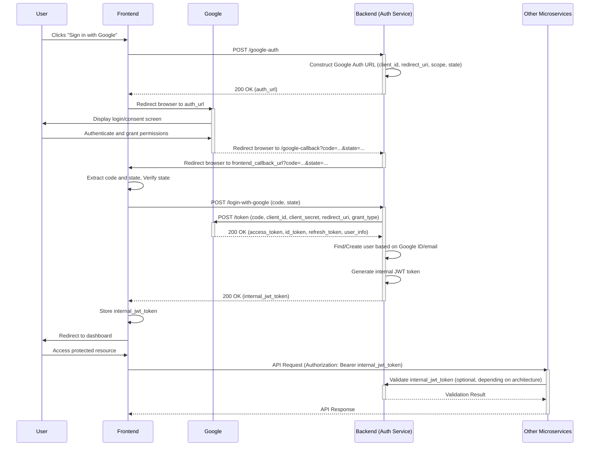

# Google OAuth 2.0 Integration

This document explains how to set up and use Google OAuth 2.0 authentication with the authentication service.

## Overview

Google OAuth 2.0 integration allows users to sign in to your application using their Google accounts. The authentication service handles the OAuth flow and translates Google authentication into your standard JWT tokens, maintaining compatibility with existing microservices.

## How It Works

The Google OAuth 2.0 flow works as follows:

1. User clicks "Sign in with Google" on your frontend
2. Frontend requests a Google authorization URL from the auth service
3. Frontend redirects the user to Google's login page
4. User authenticates with Google and grants permissions
5. Google redirects back to your application with an authorization code
6. Frontend sends this code to the auth service
7. Auth service exchanges the code for Google tokens and user information
8. Auth service finds or creates the user in your database
9. Auth service returns a JWT token, same as with password authentication
10. Frontend stores the JWT token and uses it for API calls

This approach maintains compatibility with your microservices because the resulting JWT token is identical in structure to tokens from password-based authentication.


## Detailed Authentication Flow

This section provides a step-by-step breakdown of the Google OAuth 2.0 authentication flow, detailing the interactions between the user, frontend, Google, and the backend authentication service.

### 1. Initiation and Authorization Request

1.  **User Action:** The user clicks a "Sign in with Google" button on the frontend.
2.  **Frontend Action:** The frontend makes a POST request to the backend authentication service's `/google-auth` endpoint to obtain the Google authorization URL.
3.  **Backend Action:** The backend constructs the Google authorization URL, including the `client_id`, `redirect_uri`, `scope`, and optionally a `state` parameter for CSRF protection.
4.  **Backend Response:** The backend returns the generated authorization URL to the frontend.
5.  **Frontend Action:** The frontend redirects the user's browser to the Google authorization URL.

### 2. User Authentication and Consent

6.  **User Action:** The user is presented with Google's login page (if not already logged in) and then a consent screen asking for permission to share their information with the application.
7.  **User Action:** The user logs in (if necessary) and grants the requested permissions.

### 3. Authorization Code Grant

8.  **Google Action:** Upon successful authentication and consent, Google redirects the user's browser back to the `redirect_uri` specified in the initial request. This redirect includes an `authorization code` and the `state` parameter (if used) as query parameters.

### 4. Code Exchange for Tokens

9.  **Frontend Action:** The frontend extracts the `authorization code` and `state` parameter from the redirect URL. It should verify the `state` parameter against the one sent in step 3 to prevent CSRF attacks. The backend generates this `state` parameter using a random 32-character string of letters and digits.
10. **Frontend Action:** After being redirected from Google to the backend's `/google-callback` endpoint, the frontend callback handler extracts the `authorization code` and `state` parameter from the URL and sends a POST request to the backend authentication service's `/login-with-google` endpoint, including the `authorization code` in the request body.
11. **Backend Action:** The backend receives the `authorization code`. It then makes a server-to-server request to Google's token endpoint using the `httpx` library, exchanging the `authorization code` for Google's `access_token`, `id_token`, and `refresh_token`. This request includes the `client_id` and `client_secret` for authentication with Google.
12. **Google Action:** Google validates the code and credentials and, if valid, returns the tokens and user information (decoded from the `id_token`) to the backend.

### 5. User Management and Session Creation

13. **Backend Action:** The backend uses the user information obtained from Google (e.g., email, Google ID) to find an existing user in its database.
14. **Backend Action:** The backend attempts to find an existing user first by their Google ID (`profile.get('sub')`).
    *   If a user with the matching Google ID is found, that user is authenticated.
    *   If no user is found by Google ID, the backend then attempts to find a user by their email address (`profile.get('email')`).
    *   If a user is found by email but does not have a Google ID linked, the backend links the Google ID to this existing account. The user's `auth_type` is updated to 'both' if they previously had a password, or 'google' otherwise. If the user's email was not previously verified, it is marked as verified during this process as Google has verified the email.
    *   If no user is found by either Google ID or email, the backend creates a new user account using the information from the Google profile. The `google_id` is set, the `auth_type` is set to 'google', and the `is_verified` flag is set to `True` as Google has verified the email. The `hashed_password` is set to `None` for OAuth-only users.
15. **Backend Action:** The backend generates its own internal JWT token for the authenticated or newly created user. This token is the same format as tokens issued for password-based authentication.
16. **Backend Response:** The backend returns its internal JWT token (and potentially user information) to the frontend.

### 6. Session Management and API Access

17. **Frontend Action:** The frontend receives the internal JWT token and stores it securely (e.g., in an HttpOnly cookie or local storage).
18. **Frontend Action:** The frontend redirects the user to the application's dashboard or a relevant page.
19. **Frontend Action:** For subsequent API calls to other microservices, the frontend includes the internal JWT token in the `Authorization: Bearer <token>` header.
20. **Microservice Action:** Other microservices validate the internal JWT token using the authentication service's public key or validation endpoint, granting access based on the user's identity and permissions embedded in the token.

### 7. Error Handling within the Flow

The backend service (`oauth_service.py`) implements specific error handling using `HTTPException` for various failure scenarios during the OAuth flow.

*   **Invalid Authorization Request (Step 1-5):** If the initial request to Google is malformed or missing parameters, Google will display an error to the user. The backend validates parameters before generating the URL.
*   **User Denies Consent (Step 6-7):** If the user denies consent, Google redirects back to the `redirect_uri` with an error parameter. The frontend should handle this gracefully, informing the user that authentication failed because permissions were not granted.
*   **Invalid Redirect (Step 8):** If the `redirect_uri` is not authorized in the Google Cloud Console, Google will not redirect the user.
*   **Invalid Code Exchange (Step 10-12):** If the `authorization code` is invalid, expired, or already used, Google's token endpoint will return an error. The backend handles this by logging the error and raising an `HTTPException` with `status_code=400` and a detail message like "Failed to authenticate with Google".
*   **State Parameter Mismatch (Step 9):** If the `state` parameter returned by Google does not match the one sent by the frontend, it indicates a potential CSRF attack. The frontend should abort the process and display an error.
*   **User Profile Retrieval Errors (after Step 12):** If fetching the user profile from Google using the access token fails (e.g., invalid token), the backend logs the error and raises an `HTTPException` with `status_code=400` and a detail message like "Failed to get user information from Google".
*   **User Management Errors (Step 13-15):** Errors during user lookup, creation, or linking (e.g., database errors, email conflicts during linking) are caught by the backend. The backend logs the error and returns an appropriate HTTP status code and error message to the frontend (e.g., `HTTPException` with `status_code=409` for email already in use, `status_code=500` for internal errors).
*   **Token Generation Errors (Step 15):** If the backend fails to generate its internal JWT token, it should return a 500 Internal Server Error.
*   **Unlinking Account without Password:** Attempting to unlink a Google account when the user does not have a password set on their account will result in an `HTTPException` with `status_code=400` and a detail message "Cannot unlink Google account without setting a password first".

### Authentication Sequence Diagram


## Setting Up Google OAuth

### 1. Create Google OAuth Credentials

1. Go to the [Google Cloud Console](https://console.cloud.google.com/)
2. Create a new project or select an existing one
3. Navigate to "APIs & Services" > "Credentials"
4. Click "Create Credentials" > "OAuth client ID"
5. Select "Web application" as the application type
6. Add your authorized JavaScript origins (e.g., `http://localhost:8000`)
7. Add your authorized redirect URIs (e.g., `http://localhost:8000/auth/google/callback`)
8. Click "Create" to generate your client ID and client secret

### 2. Configure Environment Variables

Add the following environment variables to your `.env` file:

```
GOOGLE_CLIENT_ID=your-client-id-here
GOOGLE_CLIENT_SECRET=your-client-secret-here
GOOGLE_REDIRECT_URI=http://localhost:8000/auth/google/callback
OAUTH_SCOPES=openid email profile
```

### 3. Run Database Migrations

Apply the database migrations to add OAuth-related fields to your user model:

```bash
alembic upgrade head
```

## API Endpoints

### Get Google Login URL

```
POST /google-auth
```

This endpoint is used by the frontend to initiate the Google OAuth flow by obtaining the authorization URL.

**Request Body:**
```json
{
  "redirect_uri": "optional-custom-redirect-uri"
}
```

**Response:**
```json
{
  "authorization_url": "https://accounts.google.com/o/oauth2/auth?client_id=..."
}
```

### Google Callback Redirect

```
GET /google-callback
```

This is the endpoint configured in the Google Cloud Console as the authorized redirect URI. Google redirects the user's browser to this endpoint after authentication and consent, including the authorization `code` or an `error` in the query parameters. This backend endpoint then redirects the user's browser to a frontend callback URL (`settings.FRONTEND_URL/api/auth/google-callback`) to complete the process on the frontend.

**Query Parameters:**
- `code` (optional): The authorization code from Google.
- `error` (optional): An error message from Google if the authentication failed.
- `state` (optional): The state parameter for CSRF protection.

**Response:**
- Redirects the user's browser to the configured frontend callback URL with the `code`, `error`, and `state` parameters.

### Login with Google

```
POST /login-with-google
```

This endpoint is called by the frontend callback handler (after being redirected from `/google-callback`). It receives the authorization `code` from the frontend, exchanges it for Google tokens, finds or creates the user, and returns the backend's internal JWT token.

**Request Body:**
```json
{
  "code": "4/0AeaYSHDGS...",
  "redirect_uri": "optional-custom-redirect-uri"
}
```

**Response:**
```json
{
  "access_token": "eyJhbGciOiJ...",
  "token_type": "bearer"
}
```

### Link Google Account (for existing users)

```
POST /link-google-account
```

This endpoint allows an authenticated user to link their existing account with a Google account.

**Request Body:**
```json
{
  "code": "4/0AeaYSHDGS...",
  "password": "current-password"
}
```

**Response:**
```json
{
  "message": "Google account linked successfully",
  "email": "user@example.com",
  "auth_type": "both"
}
```

### Unlink Google Account

Users can unlink their Google account from their profile. **Note:** A user must have a password set on their account before they can unlink their Google account. Attempting to unlink without a password will result in an error.

```
POST /unlink-google-account
```

**Response:**
```json
{
  "message": "Google account unlinked successfully",
  "email": "user@example.com",
  "auth_type": "password"
}
```


## Frontend Integration

### Basic Frontend Integration

```javascript
// 1. Get Google login URL
async function getGoogleLoginUrl() {
  // Call the backend endpoint to get the Google authorization URL
  const response = await fetch('http://localhost:8000/google-auth', {
    method: 'POST',
    headers: {
      'Content-Type': 'application/json',
    },
    body: JSON.stringify({}) // Send empty body as per backend endpoint
  });
  const data = await response.json();
  return data.authorization_url; // Use 'authorization_url' as per backend response
}

// 2. Redirect to Google
function redirectToGoogle() {
  getGoogleLoginUrl().then(url => {
    window.location.href = url;
  });
}

// 3. Handle callback from Google
// 3. Handle the callback from Google (on your frontend callback page)
// This function is called after the user is redirected from Google to the backend's /google-callback,
// which then redirects to your frontend callback URL with the code.
async function handleGoogleCallback(code) {
  // Send the authorization code to the backend endpoint to complete the login
  const response = await fetch('http://localhost:8000/login-with-google', {
    method: 'POST',
    headers: {
      'Content-Type': 'application/json',
    },
    body: JSON.stringify({ code: code }) // Send code in the request body
  });
  
  if (!response.ok) {
    // Handle errors (e.g., invalid code)
    const errorData = await response.json();
    console.error('Google login failed:', errorData);
    alert('Google login failed: ' + (errorData.detail || 'Unknown error'));
    return;
  }

  const data = await response.json();
  // Store the backend's JWT token in local storage
  localStorage.setItem('token', data.access_token);
  // Redirect to dashboard or desired page
  window.location.href = '/dashboard';
}

### Account Linking

To allow users to link their Google account to an existing account, the backend associates the Google ID with the user's existing profile and updates their `auth_type`.

```javascript
async function linkGoogleAccount(code, password) {
  const token = localStorage.getItem('token'); // Current JWT token
  
  const response = await fetch('http://localhost:8000/link-google-account', {
    method: 'POST',
    headers: {
      'Content-Type': 'application/json',
      'Authorization': `Bearer ${token}` // Include the user's current JWT token
    },
    body: JSON.stringify({
      code: code, // The authorization code obtained from Google
      password: password // The user's current password for verification
    })
  });
  
  if (!response.ok) {
    // Handle errors (e.g., invalid password, account already linked)
    const errorData = await response.json();
    console.error('Account linking failed:', errorData);
    alert('Account linking failed: ' + (errorData.detail || 'Unknown error'));
    return;
  }

  const data = await response.json();
  console.log('Account linked successfully:', data);
  alert('Google account linked successfully!');
  return data;
}
```
    // Should not happen if Google redirects correctly, but handle defensively
    console.error('Google OAuth callback received without code or error.');
    alert('Google OAuth failed: Invalid callback.');
  }
}

// Example usage on your frontend callback page:
// document.addEventListener('DOMContentLoaded', processGoogleCallback);
```

### Account Linking

To allow users to link their Google account to an existing account, the backend associates the Google ID with the user's existing profile and updates their `auth_type`.

```javascript
async function linkGoogleAccount(code, password) {
  const token = localStorage.getItem('token'); // Current JWT token
  
  const response = await fetch('http://localhost:8000/auth/link/google', {
    method: 'POST',
    headers: {
      'Content-Type': 'application/json',
      'Authorization': `Bearer ${token}`
    },
    body: JSON.stringify({
      provider: 'google',
      code,
      password
    })
  });
  
  const data = await response.json();
  return data;
}
```

## User Model Changes

The User model has been updated with these new fields:

- `google_id`: A unique identifier from Google
- `auth_type`: Indicates how the user authenticates ("password", "google", or "both")
- `hashed_password`: Now nullable to support OAuth-only users

## Database Schema Updates

The migration script adds the following changes to your database:

- Makes the `hashed_password` column nullable for OAuth-only users
- Adds the `google_id` column (String, nullable, unique)
- Adds the `auth_type` column (String, default="password")
- Creates a unique index on `google_id`

## Security Considerations

1. **Token Security**: JWT tokens should be stored securely on the frontend (e.g., in HttpOnly cookies)
2. **HTTPS**: Always use HTTPS in production to secure OAuth callbacks
3. **State Parameter**: Implement the state parameter to prevent CSRF attacks
4. **Scope Limitations**: Only request the minimum scopes needed
5. **Account Linking**: Require password verification when linking Google accounts to existing accounts

## Troubleshooting

### Common Issues

1. **Invalid Client ID**: Ensure your GOOGLE_CLIENT_ID environment variable is set correctly
2. **Redirect URI Mismatch**: The redirect URI in your code must exactly match one of the authorized redirect URIs in your Google Cloud Console
3. **Missing Scopes**: Ensure the OAUTH_SCOPES environment variable includes at least "openid email profile"
4. **Database Migration**: Ensure you've run the migration to add the new user fields
5. **Cookie Setting in Next.js**: When using Next.js Route Handlers, cookies must be set directly on the NextResponse object, not using the cookies() API from next/headers

### Verifying Configuration

You can verify your OAuth configuration at startup by checking the logs. The service validates the OAuth configuration and logs any issues.

## Known Issues and Solutions

### Cookie Setting in Next.js Route Handlers

**Issue**: When implementing Google OAuth with Next.js, the accessToken cookie may not be properly set when using the `cookies()` API from `next/headers` in Route Handlers.

**Symptoms**:
- User completes Google authentication successfully
- User gets redirected back to the application
- No accessToken cookie is set in the browser
- Errors like "No accessToken were found" appear in logs

**Root Cause**:
In Next.js Route Handlers (app router), the `cookies()` API from `next/headers` doesn't properly attach cookies to the HTTP response that's sent back to the client. This is particularly problematic in OAuth flows where redirects are involved.

**Solution**:
1. Create the NextResponse object first
2. Set the cookie directly on the response object using `response.cookies.set()`
3. Then return the response

**Example**:
```typescript
// INCORRECT approach (doesn't work):
const cookieStore = cookies(); // From next/headers
cookieStore.set('accessToken', data.access_token, {...});
return NextResponse.redirect(redirectUrl);

// CORRECT approach:
const response = NextResponse.redirect(redirectUrl);
response.cookies.set('accessToken', data.access_token, {...});
return response;
```

**Additional Recommendations**:
- Implement redundant cookie-setting methods to increase reliability
- Add detailed logging throughout the authentication flow to diagnose issues
- Consider using both server-side cookie setting and client-side cookie setting as fallbacks

## Example Implementation

See the example implementation in `examples/google_oauth_example.html` for a complete frontend integration demo.