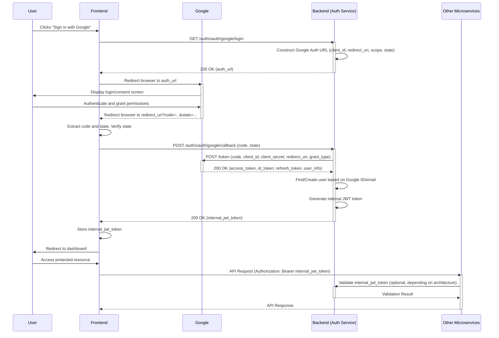

# Google OAuth 2.0 Integration

This document explains how to set up and use Google OAuth 2.0 authentication with the authentication service.

## Overview

Google OAuth 2.0 integration allows users to sign in to your application using their Google accounts. The authentication service handles the OAuth flow and translates Google authentication into your standard JWT tokens, maintaining compatibility with existing microservices.

## How It Works

The Google OAuth 2.0 flow works as follows:

1. User clicks "Sign in with Google" on your frontend
2. Frontend requests a Google authorization URL from the auth service
3. Frontend redirects the user to Google's login page
4. User authenticates with Google and grants permissions
5. Google redirects back to your application with an authorization code
6. Frontend sends this code to the auth service
7. Auth service exchanges the code for Google tokens and user information
8. Auth service finds or creates the user in your database
9. Auth service returns a JWT token, same as with password authentication
10. Frontend stores the JWT token and uses it for API calls

This approach maintains compatibility with your microservices because the resulting JWT token is identical in structure to tokens from password-based authentication.


## Detailed Authentication Flow

This section provides a step-by-step breakdown of the Google OAuth 2.0 authentication flow, detailing the interactions between the user, frontend, Google, and the backend authentication service.

### 1. Initiation and Authorization Request

1.  **User Action:** The user clicks a "Sign in with Google" button on the frontend.
2.  **Frontend Action:** The frontend makes a request to the backend authentication service's `/auth/oauth/google/login` endpoint to obtain the Google authorization URL.
3.  **Backend Action:** The backend constructs the Google authorization URL, including the `client_id`, `redirect_uri`, `scope`, and optionally a `state` parameter for CSRF protection.
4.  **Backend Response:** The backend returns the generated authorization URL to the frontend.
5.  **Frontend Action:** The frontend redirects the user's browser to the Google authorization URL.

### 2. User Authentication and Consent

6.  **User Action:** The user is presented with Google's login page (if not already logged in) and then a consent screen asking for permission to share their information with the application.
7.  **User Action:** The user logs in (if necessary) and grants the requested permissions.

### 3. Authorization Code Grant

8.  **Google Action:** Upon successful authentication and consent, Google redirects the user's browser back to the `redirect_uri` specified in the initial request. This redirect includes an `authorization code` and the `state` parameter (if used) as query parameters.

### 4. Code Exchange for Tokens

9.  **Frontend Action:** The frontend extracts the `authorization code` and `state` parameter from the redirect URL. It should verify the `state` parameter against the one sent in step 3 to prevent CSRF attacks.
10. **Frontend Action:** The frontend sends a POST request to the backend authentication service's `/auth/oauth/google/callback` endpoint, including the `authorization code` in the request body.
11. **Backend Action:** The backend receives the `authorization code`. It then makes a server-to-server request to Google's token endpoint, exchanging the `authorization code` for Google's `access_token`, `id_token`, and `refresh_token`. This request includes the `client_id` and `client_secret` for authentication with Google.
12. **Google Action:** Google validates the code and credentials and, if valid, returns the tokens and user information (decoded from the `id_token`) to the backend.

### 5. User Management and Session Creation

13. **Backend Action:** The backend uses the user information obtained from Google (e.g., email, Google ID) to find an existing user in its database.
14. **Backend Action:**
    *   If a user with the same Google ID exists, the backend authenticates this user.
    *   If a user with the same email exists but no Google ID is linked, the backend may link the Google ID to the existing account (depending on application logic, potentially requiring additional verification like password).
    *   If no user exists with either the Google ID or email, the backend creates a new user account using the information from Google. The `auth_type` for this user is set to 'google' or 'both' if linked.
15. **Backend Action:** The backend generates its own internal JWT token for the authenticated or newly created user. This token is the same format as tokens issued for password-based authentication.
16. **Backend Response:** The backend returns its internal JWT token (and potentially user information) to the frontend.

### 6. Session Management and API Access

17. **Frontend Action:** The frontend receives the internal JWT token and stores it securely (e.g., in an HttpOnly cookie or local storage).
18. **Frontend Action:** The frontend redirects the user to the application's dashboard or a relevant page.
19. **Frontend Action:** For subsequent API calls to other microservices, the frontend includes the internal JWT token in the `Authorization: Bearer <token>` header.
20. **Microservice Action:** Other microservices validate the internal JWT token using the authentication service's public key or validation endpoint, granting access based on the user's identity and permissions embedded in the token.

### 7. Error Handling within the Flow

*   **Invalid Authorization Request (Step 1-5):** If the initial request to Google is malformed or missing parameters, Google will display an error to the user. The backend should validate parameters before generating the URL.
*   **User Denies Consent (Step 6-7):** If the user denies consent, Google redirects back to the `redirect_uri` with an error parameter. The frontend should handle this gracefully, informing the user that authentication failed because permissions were not granted.
*   **Invalid Redirect (Step 8):** If the `redirect_uri` is not authorized in the Google Cloud Console, Google will not redirect the user.
*   **Invalid Code Exchange (Step 10-12):** If the `authorization code` is invalid, expired, or already used, Google's token endpoint will return an error. The backend must handle this error, log it, and return an appropriate error response to the frontend (e.g., 400 Bad Request).
*   **State Parameter Mismatch (Step 9):** If the `state` parameter returned by Google does not match the one sent by the frontend, it indicates a potential CSRF attack. The frontend should abort the process and display an error.
*   **User Management Errors (Step 13-15):** Errors during user lookup, creation, or linking (e.g., database errors, email conflicts during linking) must be caught by the backend. The backend should log the error and return an appropriate HTTP status code and error message to the frontend (e.g., 409 Conflict for email already in use, 500 Internal Server Error).
*   **Token Generation Errors (Step 15):** If the backend fails to generate its internal JWT token, it should return a 500 Internal Server Error.

### Authentication Sequence Diagram


## Setting Up Google OAuth

### 1. Create Google OAuth Credentials

1. Go to the [Google Cloud Console](https://console.cloud.google.com/)
2. Create a new project or select an existing one
3. Navigate to "APIs & Services" > "Credentials"
4. Click "Create Credentials" > "OAuth client ID"
5. Select "Web application" as the application type
6. Add your authorized JavaScript origins (e.g., `http://localhost:8000`)
7. Add your authorized redirect URIs (e.g., `http://localhost:8000/auth/google/callback`)
8. Click "Create" to generate your client ID and client secret

### 2. Configure Environment Variables

Add the following environment variables to your `.env` file:

```
GOOGLE_CLIENT_ID=your-client-id-here
GOOGLE_CLIENT_SECRET=your-client-secret-here
GOOGLE_REDIRECT_URI=http://localhost:8000/auth/google/callback
OAUTH_SCOPES=openid email profile
```

### 3. Run Database Migrations

Apply the database migrations to add OAuth-related fields to your user model:

```bash
alembic upgrade head
```

## API Endpoints

### Get Google Login URL

```
GET /auth/oauth/google/login
```

**Query Parameters:**
- `redirect_uri` (optional): Custom redirect URI for this request

**Response:**
```json
{
  "auth_url": "https://accounts.google.com/o/oauth2/auth?client_id=..."
}
```

### Process Google Callback

```
POST /auth/oauth/google/callback
```

**Request Body:**
```json
{
  "code": "4/0AeaYSHDGS...",
  "state": "optional-state-parameter"
}
```

**Response:**
```json
{
  "access_token": "eyJhbGciOiJ...",
  "token_type": "bearer"
}
```

### Link Google Account (for existing users)

```
POST /auth/link/google
```

**Request Body:**
```json
{
  "provider": "google",
  "code": "4/0AeaYSHDGS...",
  "password": "current-password"
}
```

**Response:**
```json
{
  "message": "Google account linked successfully"
}
```

### Unlink Google Account

```
POST /auth/unlink/google
```

**Response:**
```json
{
  "message": "Google account unlinked successfully"
}
```

## Frontend Integration

### Basic Frontend Integration

```javascript
// 1. Get Google login URL
async function getGoogleLoginUrl() {
  const response = await fetch('http://localhost:8000/auth/oauth/google/login');
  const data = await response.json();
  return data.auth_url;
}

// 2. Redirect to Google
function redirectToGoogle() {
  getGoogleLoginUrl().then(url => {
    window.location.href = url;
  });
}

// 3. Handle callback from Google
async function handleGoogleCallback(code) {
  const response = await fetch('http://localhost:8000/auth/oauth/google/callback', {
    method: 'POST',
    headers: {
      'Content-Type': 'application/json',
    },
    body: JSON.stringify({ code })
  });
  
  const data = await response.json();
  // Store token in local storage
  localStorage.setItem('token', data.access_token);
  // Redirect to dashboard
  window.location.href = '/dashboard';
}

// On your callback page
function processCallback() {
  const urlParams = new URLSearchParams(window.location.search);
  const code = urlParams.get('code');
  
  if (code) {
    handleGoogleCallback(code);
  }
}
```

### Account Linking

To allow users to link their Google account to an existing account:

```javascript
async function linkGoogleAccount(code, password) {
  const token = localStorage.getItem('token'); // Current JWT token
  
  const response = await fetch('http://localhost:8000/auth/link/google', {
    method: 'POST',
    headers: {
      'Content-Type': 'application/json',
      'Authorization': `Bearer ${token}`
    },
    body: JSON.stringify({
      provider: 'google',
      code,
      password
    })
  });
  
  const data = await response.json();
  return data;
}
```

## User Model Changes

The User model has been updated with these new fields:

- `google_id`: A unique identifier from Google
- `auth_type`: Indicates how the user authenticates ("password", "google", or "both")
- `hashed_password`: Now nullable to support OAuth-only users

## Database Schema Updates

The migration script adds the following changes to your database:

- Makes the `hashed_password` column nullable for OAuth-only users
- Adds the `google_id` column (String, nullable, unique)
- Adds the `auth_type` column (String, default="password")
- Creates a unique index on `google_id`

## Security Considerations

1. **Token Security**: JWT tokens should be stored securely on the frontend (e.g., in HttpOnly cookies)
2. **HTTPS**: Always use HTTPS in production to secure OAuth callbacks
3. **State Parameter**: Implement the state parameter to prevent CSRF attacks
4. **Scope Limitations**: Only request the minimum scopes needed
5. **Account Linking**: Require password verification when linking Google accounts to existing accounts

## Troubleshooting

### Common Issues

1. **Invalid Client ID**: Ensure your GOOGLE_CLIENT_ID environment variable is set correctly
2. **Redirect URI Mismatch**: The redirect URI in your code must exactly match one of the authorized redirect URIs in your Google Cloud Console
3. **Missing Scopes**: Ensure the OAUTH_SCOPES environment variable includes at least "openid email profile"
4. **Database Migration**: Ensure you've run the migration to add the new user fields

### Verifying Configuration

You can verify your OAuth configuration at startup by checking the logs. The service validates the OAuth configuration and logs any issues.

## Example Implementation

See the example implementation in `examples/google_oauth_example.html` for a complete frontend integration demo.