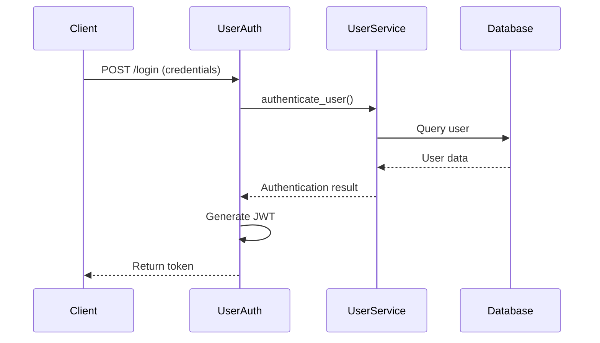
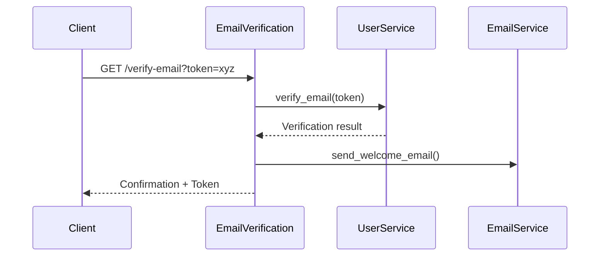
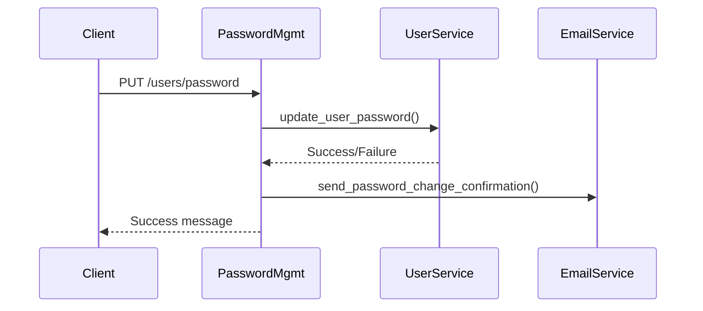
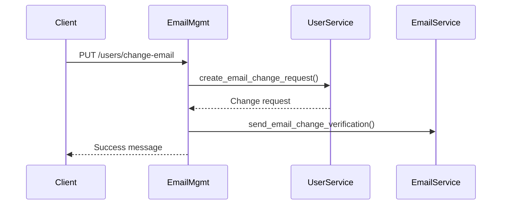
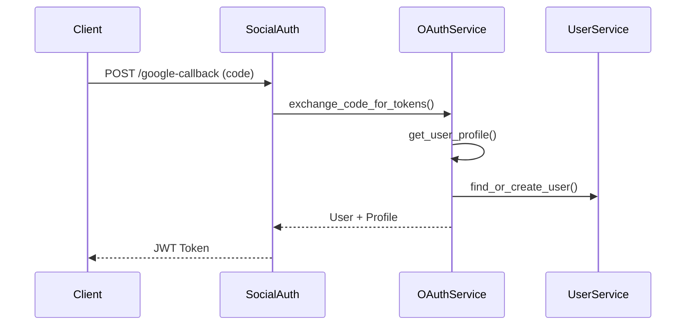

# Auth Router Refactoring Plan

## Current Analysis

The auth_router.py file has grown significantly (890 lines) and handles multiple concerns:

1. **User Authentication**: Login, registration, token generation
2. **Email Verification**: Verifying new accounts, resending verification emails
3. **Password Management**: Changing passwords
4. **Email Management**: Changing email addresses, verifying changes
5. **Social Authentication**: Google OAuth integration
6. **Internal Utilities**: Template verification, internal lookups

## Proposed File Structure

```
app/
└── routers/
    ├── auth/
    │   ├── __init__.py
    │   ├── auth_router.py         # Main aggregator router
    │   ├── user_auth.py           # Core authentication endpoints
    │   ├── email_verification.py  # Email verification flows
    │   ├── password_management.py # Password change/reset
    │   ├── email_management.py    # Email change flow
    │   ├── social_auth.py         # OAuth integration
    │   └── auth_utils.py          # Utility endpoints
    └── [other routers...]
```

## Detailed Module Specifications

### 1. user_auth.py

**Purpose**: Core authentication functionality

**Endpoints**:
- `POST /login` - User login
- `POST /register` - User registration
- `GET /users/by-email/{email}` - Internal user lookup

**Dependencies**:
- UserService
- EmailService
- Authentication utilities

**Flow Diagram**:


### 2. email_verification.py

**Purpose**: Email verification functionality

**Endpoints**:
- `GET /verify-email` - Verify email with token
- `POST /resend-verification` - Resend verification email

**Dependencies**:
- UserService
- EmailService

**Flow Diagram**:


### 3. password_management.py

**Purpose**: Password change and reset flows

**Endpoints**:
- `PUT /users/password` - Change password (authenticated)
- `POST /reset-password-request` - Request password reset
- `POST /reset-password` - Reset password with token

**Dependencies**:
- UserService
- EmailService
- Authentication utilities

**Flow Diagram**:


### 4. email_management.py

**Purpose**: Email change functionality

**Endpoints**:
- `PUT /users/change-email` - Request email change
- `GET /verify-email-change` - Verify new email with token

**Dependencies**:
- UserService
- EmailService
- Authentication utilities

**Flow Diagram**:


### 5. social_auth.py

**Purpose**: Social login integration

**Endpoints**:
- `POST /google-auth` - Get Google authorization URL
- `POST /google-callback` - Handle OAuth callback
- `POST /link-google-account` - Link Google to existing account
- `POST /unlink-google-account` - Remove Google connection

**Dependencies**:
- OAuthService
- UserService
- Authentication utilities

**Flow Diagram**:


### 6. auth_utils.py

**Purpose**: Utility and admin endpoints

**Endpoints**:
- `GET /verify-email-templates` - Test email templates

**Dependencies**:
- EmailService
- Template utilities

### 7. Main auth_router.py

**Purpose**: Aggregate all auth-related routes

**Implementation**:
```python
from fastapi import APIRouter
from app.routers.auth.user_auth import router as user_auth_router
from app.routers.auth.email_verification import router as email_verification_router
from app.routers.auth.password_management import router as password_management_router
from app.routers.auth.email_management import router as email_management_router
from app.routers.auth.social_auth import router as social_auth_router
from app.routers.auth.auth_utils import router as auth_utils_router

router = APIRouter(tags=["authentication"])

# Include all auth-related routers
router.include_router(user_auth_router)
router.include_router(email_verification_router)
router.include_router(password_management_router)
router.include_router(email_management_router)
router.include_router(social_auth_router)
router.include_router(auth_utils_router)
```

## Migration Strategy

1. **Create directory structure** and new modules:
   - Create the auth directory
   - Create __init__.py to make it a package
   - Create all module files

2. **Move endpoints** one module at a time:
   - Copy relevant imports
   - Move endpoint function definitions
   - Update any internal references
   - Make sure tags and routes are consistent

3. **Update main auth_router.py** to include all sub-routers:
   - Import all sub-routers
   - Create main router
   - Include all sub-routers

4. **Run tests** after each module migration:
   - Ensure endpoints still work
   - Check for import errors
   - Verify authentication flows

5. **Update imports** in any files that reference the original auth_router:
   - Replace `from app.routers.auth_router import router` with `from app.routers.auth import router`

## Code Implementation Example: user_auth.py

```python
"""Router module for core authentication endpoints."""

from datetime import timedelta, datetime, timezone
from fastapi import APIRouter, Depends, HTTPException, status, BackgroundTasks
from fastapi.security import OAuth2PasswordBearer
from sqlalchemy.ext.asyncio import AsyncSession

from app.core.database import get_db
from app.core.exceptions import UserAlreadyExistsError, UserNotFoundError, InvalidCredentialsError
from app.core.security import create_access_token
from app.core.auth import get_internal_service
from app.schemas.auth_schemas import LoginRequest, Token, UserCreate, UserResponse, RegistrationResponse
from app.services.user_service import authenticate_user, create_user, get_user_by_email, UserService
from app.models.user import User
from app.log.logging import logger

router = APIRouter()
oauth2_scheme = OAuth2PasswordBearer(tokenUrl="/auth/login")

@router.post(
    "/login",
    response_model=Token,
    description="Authenticate user and return JWT token",
    responses={
        200: {"description": "Successfully authenticated"},
        401: {"description": "Invalid credentials"}
    }
)
async def login(
        credentials: LoginRequest,
        db: AsyncSession = Depends(get_db)
) -> Token:
    """Authenticate a user and return a JWT token."""
    # Implementation copied from original auth_router.py
    # ...

@router.post(
    "/register",
    status_code=status.HTTP_201_CREATED,
    response_model=RegistrationResponse,
    responses={
        201: {
            "description": "User successfully registered",
            "content": {
                "application/json": {
                    "example": {
                        "message": "User registered successfully",
                        "email": "john@example.com",
                        "verification_sent": True
                    }
                }
            }
        },
        409: {"description": "Email already exists"}
    }
)
async def register_user(
        user: UserCreate,
        background_tasks: BackgroundTasks,
        db: AsyncSession = Depends(get_db)
) -> RegistrationResponse:
    """Register a new user and send a verification email."""
    # Implementation copied from original auth_router.py
    # ...

@router.get(
    "/users/by-email/{email}",
    response_model=UserResponse,
    include_in_schema=False,  # Hide from public API docs
    responses={
        200: {"description": "User details retrieved successfully"},
        403: {"description": "Forbidden - Internal service access only"},
        404: {"description": "User not found"}
    }
)
async def get_user_details(
        email: str,
        service_id: str = Depends(get_internal_service),
        db: AsyncSession = Depends(get_db)
) -> UserResponse:
    """Retrieve user details by email (internal endpoint)."""
    # Implementation copied from original auth_router.py
    # ...
```

## Benefits of Refactoring

1. **Improved maintainability**: 
   - Smaller, focused files with clear responsibilities
   - Easier to find code related to specific auth features

2. **Better organization**: 
   - Related functionality grouped together
   - Logical separation of concerns
   - Clear module boundaries

3. **Easier collaboration**: 
   - Multiple developers can work on different auth modules
   - Fewer merge conflicts with separate files
   - More modular design = clearer ownership

4. **Future extensibility**:
   - New authentication features can be added in appropriate modules
   - Easier to add new auth methods without disrupting existing ones
   - Better testability of individual components

5. **Code readability**:
   - Each file is shorter and more focused
   - Clearer understanding of each authentication flow
   - Better documentation with module-specific docstrings