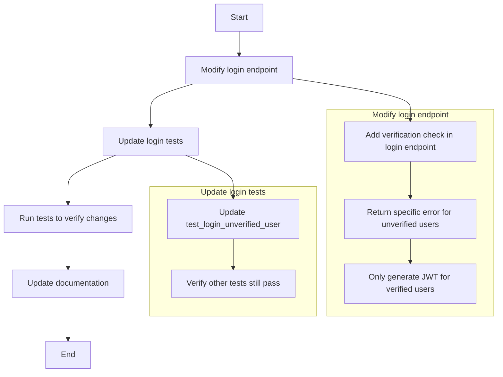

# Authentication Refactoring Plan: JWT Tokens Only After Email Verification

## Current Implementation Analysis

1. **Registration Process**:
   - Currently, when a user registers, they receive a registration response without a JWT token
   - A verification email is sent to the user
   - The user is created with `is_verified=False`

2. **Email Verification Process**:
   - When a user clicks the verification link, their account is marked as verified
   - A JWT token is generated and returned in the response
   - This allows immediate login after verification

3. **Login Process**:
   - Currently, the login endpoint allows unverified users to log in (as seen in `test_login_unverified_user` test)
   - The login endpoint does not check the `is_verified` status of the user

4. **Authentication Middleware**:
   - The `get_current_active_user` dependency checks if a user is verified
   - It raises a 403 Forbidden error if the user is not verified
   - However, this is only used for protected endpoints, not for the login process itself

## Required Changes

1. **Login Endpoint**:
   - Modify the login endpoint to check if the user is verified
   - Return a specific error message if the user is not verified
   - Only generate and return a JWT token if the user is verified

2. **Tests**:
   - Update the `test_login_unverified_user` test to expect a 403 Forbidden response
   - Ensure all other tests continue to pass

## Detailed Implementation Plan

Here's a detailed plan for implementing these changes:



### 1. Modify the Login Endpoint

We need to modify the login endpoint in `app/routers/auth_router.py` to check if the user is verified before generating a JWT token. Here's the specific change:

```python
# In the login function
if not user.is_verified:
    logger.warning("Login attempt by unverified user", event_type="login_failed", email=email, reason="unverified_user")
    raise HTTPException(
        status_code=status.HTTP_403_FORBIDDEN,
        detail="Email not verified. Please check your email for verification instructions."
    )
```

This check should be added after authenticating the user but before generating the JWT token.

### 2. Update the Login Tests

We need to update the `test_login_unverified_user` test in `tests/test_auth_router/test_login.py` to expect a 403 Forbidden response instead of a 200 OK:

```python
async def test_login_unverified_user(client, db, test_user_data):
    """Test login with unverified user."""
    # Create unverified user
    from tests.conftest import create_test_user
    await create_test_user(db, test_user_data["email"], test_user_data["password"], is_verified=False)
    
    response = client.post(
        "/auth/login",
        json={
            "email": test_user_data["email"],
            "password": test_user_data["password"]
        }
    )
    
    # The updated implementation should not allow unverified users to log in
    assert response.status_code == status.HTTP_403_FORBIDDEN
    data = response.json()
    assert "detail" in data
    assert "Email not verified" in data["detail"]
```

### 3. Documentation Updates

We should update any relevant documentation to reflect this change in behavior. This includes:

- API documentation
- User guides
- Developer documentation

## Impact Analysis

This change will impact:

1. **User Experience**:
   - Users will need to verify their email before they can log in
   - This adds an extra step in the user onboarding process
   - However, it improves security by ensuring email addresses are valid

2. **Frontend Applications**:
   - Frontend applications will need to handle the new error response
   - They should display appropriate messages to guide users to verify their email

3. **Testing**:
   - The test suite will need to be updated to reflect the new behavior
   - Specifically, the `test_login_unverified_user` test will need to be updated

## Risks and Mitigations

1. **Risk**: Existing users who haven't verified their email will suddenly be unable to log in.
   **Mitigation**: Consider adding a grace period or sending reminder emails to unverified users before implementing this change.

2. **Risk**: Frontend applications might break if they're not updated to handle the new error response.
   **Mitigation**: Coordinate with frontend teams to ensure they update their code accordingly.

3. **Risk**: The change might introduce bugs in the authentication flow.
   **Mitigation**: Thoroughly test all authentication scenarios, including registration, verification, and login.