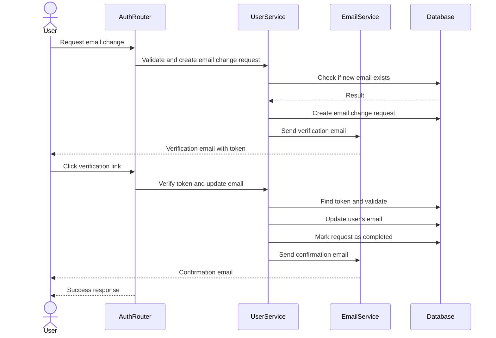

# Email Change Verification Implementation Plan

## Requirements

Implement a complete verification process for email changes that includes:
1. Checking if the new email is already registered by another user
2. Sending a confirmation email to the new address with a verification link
3. Updating the email in the database only after successful verification

## Current Implementation Analysis

The current email change process in `/users/change-email` endpoint (lines 445-615):
1. ✅ Verifies the user's password 
2. ✅ Checks if the new email is already registered by another user
3. ❌ Updates the email in the database IMMEDIATELY
4. ✅ Sets is_verified to false
5. ✅ Sends a verification email to the new address
6. ❌ Missing separate verification endpoint for email changes

## Implementation Plan

### 1. Create New Model for Email Change Requests

We need a table to track email change requests without modifying the user's email until verification is complete.

```python
# In app/models/user.py
class EmailChangeRequest(Base):
    """
    SQLAlchemy model for tracking email change requests.
    
    Attributes:
        id (int): Primary key
        user_id (int): Foreign key reference to the user requesting the change
        current_email (str): Current email address
        new_email (str): Requested new email address
        token (str): Verification token
        expires_at (datetime): Expiration timestamp for the token
        created_at (datetime): When the request was created
        completed (bool): Whether the request has been completed
    """
    __tablename__ = "email_change_requests"
    
    id = Column(Integer, primary_key=True, index=True)
    user_id = Column(Integer, ForeignKey("users.id"), nullable=False)
    current_email = Column(String(100), nullable=False)
    new_email = Column(String(100), nullable=False)
    token = Column(String(255), nullable=False, unique=True)
    expires_at = Column(DateTime(timezone=True), nullable=False)
    created_at = Column(DateTime(timezone=True), default=lambda: datetime.now(UTC))
    completed = Column(Boolean, default=False, nullable=False)
    
    # Relationship
    user = relationship("User")
```

### 2. Process Flow Diagram



### 3. UserService Enhancement

Add these methods to UserService:

```python
# In app/services/user_service.py

async def create_email_change_request(
    self, 
    user: User, 
    new_email: str,
    password: str
) -> Tuple[bool, str, Optional[EmailChangeRequest]]:
    """
    Create a request to change a user's email address.
    
    Args:
        user: User requesting the change
        new_email: New email address
        password: Current password for verification
        
    Returns:
        Tuple containing:
        - success status (bool)
        - message (str)
        - email change request if successful (Optional[EmailChangeRequest])
    """
    # Verify password
    if not verify_password(password, user.hashed_password):
        return False, "Invalid password", None
        
    # Check if email already exists for another user
    existing_user = await self.get_user_by_email(new_email)
    if existing_user and existing_user.id != user.id:
        return False, "Email already registered", None
        
    # Generate token
    alphabet = string.ascii_letters + string.digits
    token = ''.join(secrets.choice(alphabet) for _ in range(64))
    
    # Set expiration (24 hours)
    expires_at = datetime.now(UTC) + timedelta(hours=24)
    
    # Delete any existing requests for this user
    sql = text("DELETE FROM email_change_requests WHERE user_id = :user_id AND completed = FALSE")
    await self.db.execute(sql, {"user_id": user.id})
    
    # Create request
    email_change_request = EmailChangeRequest(
        user_id=user.id,
        current_email=user.email,
        new_email=new_email,
        token=token,
        expires_at=expires_at,
        completed=False
    )
    
    self.db.add(email_change_request)
    await self.db.commit()
    
    return True, "Email change request created", email_change_request

async def verify_email_change(self, token: str) -> Tuple[bool, str, Optional[User]]:
    """
    Verify an email change request and update the user's email if valid.
    
    Args:
        token: The verification token
        
    Returns:
        Tuple containing:
        - success status (bool)
        - message (str)
        - updated user if successful (Optional[User])
    """
    # Find request by token
    result = await self.db.execute(
        select(EmailChangeRequest).where(
            EmailChangeRequest.token == token,
            EmailChangeRequest.completed == False
        )
    )
    request = result.scalar_one_or_none()
    
    if not request:
        return False, "Invalid or expired token", None
        
    # Check if token expired
    if datetime.now(UTC) > request.expires_at:
        return False, "Token has expired", None
        
    # Get user
    result = await self.db.execute(
        select(User).where(User.id == request.user_id)
    )
    user = result.scalar_one_or_none()
    
    if not user:
        return False, "User not found", None
        
    # Update user's email
    old_email = user.email
    user.email = request.new_email
    user.is_verified = True  # Automatically verify since we've confirmed the email
    
    # Mark request as completed
    request.completed = True
    
    await self.db.commit()
    await self.db.refresh(user)
    
    return True, "Email updated successfully", user
```

### 4. EmailService Enhancement

Add a method to send email change verification:

```python
# In app/services/email_service.py

async def send_email_change_verification(
    self,
    user: User,
    new_email: str,
    verification_token: str
) -> None:
    """
    Send email change verification email.
    
    Args:
        user: User model instance
        new_email: The new email address
        verification_token: Token for email change verification
    """
    verification_link = f"{settings.FRONTEND_URL}/auth/verify-email-change?token={verification_token}"
    
    # Log the verification link for debugging
    logger.info(
        "Sending email change verification",
        event_type="email_change_verification_sending",
        user_id=user.id,
        current_email=user.email,
        new_email=new_email,
        verification_link=verification_link
    )
    
    await self._send_templated_email(
        template_name="email_change_verification",  # New template needed
        subject="Verify Your New Email Address",
        recipients=[new_email],  # Send to the new email address
        context={
            "email": new_email,
            "verification_link": verification_link,
            "hours_valid": 24  # Token validity in hours
        }
    )

async def send_email_change_confirmation(
    self,
    user: User,
    old_email: str
) -> None:
    """
    Send confirmation after email has been changed.
    
    Args:
        user: User model instance with updated email
        old_email: Previous email address
    """
    # Notify new email
    await self._send_templated_email(
        template_name="email_change_confirmation",  # New template needed
        subject="Email Change Confirmation",
        recipients=[str(user.email)],  # New email
        context={
            "old_email": old_email,
            "new_email": user.email,
            "login_link": f"{settings.FRONTEND_URL}/login",
            "time": datetime.now(UTC).strftime("%Y-%m-%d %H:%M UTC")
        }
    )
    
    # Optional: Notify old email about the change
    await self._send_templated_email(
        template_name="email_change_notification",  # New template needed
        subject="Your Email Has Been Changed",
        recipients=[old_email],  # Old email
        context={
            "old_email": old_email,
            "new_email": user.email,
            "support_link": f"{settings.FRONTEND_URL}/support",
            "time": datetime.now(UTC).strftime("%Y-%m-%d %H:%M UTC")
        }
    )
```

### 5. Auth Router Changes

#### 5.1 Update the `/users/change-email` endpoint:

```python
@router.put(
    "/users/change-email",
    response_model=Dict[str, Any],
    responses={
        200: {
            "description": "Email change verification sent",
            "content": {
                "application/json": {
                    "example": {
                        "message": "Verification email sent to new address",
                        "new_email": "new.email@example.com",
                        "verification_sent": True
                    }
                }
            }
        },
        400: {"description": "Email already registered or invalid format"},
        401: {"description": "Invalid password or unauthorized"},
        404: {"description": "User not found"}
    }
)
async def request_email_change(
    email_change: EmailChange,
    background_tasks: BackgroundTasks,
    db: AsyncSession = Depends(get_db),
    current_user: User = Depends(get_current_active_user)
) -> Dict[str, Any]:
    """
    Request to change user's email address.
    
    This creates an email change request and sends a verification email
    to the new email address. The email will only be updated after
    verification.
    
    Args:
        email_change: Current password and new email
        background_tasks: FastAPI background tasks
        db: Database session
        current_user: Authenticated user
        
    Returns:
        Dict with status information
    """
    try:
        # Initialize services
        user_service = UserService(db)
        email_service = EmailService(background_tasks, db)
        
        # Create change request
        success, message, request = await user_service.create_email_change_request(
            current_user,
            email_change.new_email,
            email_change.current_password
        )
        
        if not success:
            logger.error(
                "Email change request failed",
                event_type="email_change_error",
                email=current_user.email,
                new_email=str(email_change.new_email),
                error_type="validation_error",
                error_message=message
            )
            raise HTTPException(
                status_code=status.HTTP_400_BAD_REQUEST,
                detail=message
            )
            
        # Send verification email
        await email_service.send_email_change_verification(
            current_user,
            str(email_change.new_email),
            request.token
        )
        
        logger.info(
            "Email change requested",
            event_type="email_change_requested",
            user_id=current_user.id,
            current_email=current_user.email,
            new_email=str(email_change.new_email)
        )
        
        return {
            "message": "Verification email sent to new address",
            "new_email": str(email_change.new_email),
            "verification_sent": True
        }
        
    except HTTPException as http_ex:
        # Re-raise HTTP exceptions
        raise http_ex
    except Exception as e:
        logger.error(
            "Email change request error",
            event_type="email_change_error",
            email=current_user.email,
            new_email=str(email_change.new_email),
            error_type=type(e).__name__,
            error_details=str(e)
        )


### 6. Email Templates

After examining the existing templates, I'll create three new templates for the email change process, based on the existing structure:

#### 6.1 `email_change_verification.html`

This template will be similar to the `registration_confirmation.html` template but with text modified for email change context. It will be sent to the new email address and contain:

- A greeting message explaining that someone requested to change their email to this address
- A verification button/link to confirm the email change
- Information about link expiration (24 hours)
- Security notice if they didn't request this change

#### 6.2 `email_change_confirmation.html`

This will be similar to `password_change_confirmation.html` and will be sent to the new email address after successful verification. It will contain:

- Confirmation message that the email has been successfully changed
- Information about the old and new email addresses
- Link to login page
- Security information (IP address and timestamp)

#### 6.3 `email_change_notification.html`

This is a new template to notify the old email address about the change. It will contain:

- Notification that the email address associated with the account has been changed
- Information about the new email address
- Contact support link if they didn't authorize this change
- Security information (IP address and timestamp)

        raise HTTPException(
            status_code=status.HTTP_500_INTERNAL_SERVER_ERROR,
            detail=f"Error processing email change request: {str(e)}"
        )
```

#### 5.2 Add a new endpoint for verifying email changes:

```python
@router.get(
    "/verify-email-change",
    response_model=Dict[str, Any],
    responses={
        200: {"description": "Email successfully changed"},
        400: {"description": "Invalid or expired verification token"}
    }
)
async def verify_email_change(
    token: str,
    background_tasks: BackgroundTasks,
    db: AsyncSession = Depends(get_db)
) -> Dict[str, Any]:
    """
    Verify and complete an email change request.
    
    This endpoint is accessed via the verification link sent to the new email.
    If the token is valid, the user's email will be updated.
    
    Args:
        token: The verification token from the email
        background_tasks: FastAPI background tasks
        db: Database session
        
    Returns:
        Dict with success message and auth token
    """
    try:
        # Initialize services
        user_service = UserService(db)
        email_service = EmailService(background_tasks, db)
        
        # Verify the token and update email
        success, message, user = await user_service.verify_email_change(token)
        
        if not success or not user:
            logger.warning(
                "Email change verification failed",


## Implementation Steps

### Step 1: Create the EmailChangeRequest Model

1. Add the `EmailChangeRequest` class to `app/models/user.py`
2. Create a migration file to add the corresponding table
3. Run the migration

### Step 2: Enhance the User Service

1. Add the `create_email_change_request` method to `UserService` class
2. Add the `verify_email_change` method to `UserService` class
3. Ensure proper error handling and logging

### Step 3: Enhance the Email Service

1. Add the `send_email_change_verification` method to `EmailService` class
2. Add the `send_email_change_confirmation` method to `EmailService` class
3. Implement proper error handling and logging

### Step 4: Create Email Templates

1. Create `email_change_verification.html` based on `registration_confirmation.html`
2. Create `email_change_confirmation.html` based on `password_change_confirmation.html`
3. Create `email_change_notification.html` as a new template

### Step 5: Update the Auth Router

1. Modify the existing `/users/change-email` endpoint to use the new flow
2. Add a new `/verify-email-change` endpoint for token verification
3. Ensure proper error handling, logging, and token generation

### Step 6: Testing

1. Write unit tests for the new UserService methods
2. Write unit tests for the new EmailService methods
3. Write integration tests for the email change flow
4. Perform manual testing of the entire flow

### Step 7: Documentation

1. Update API documentation to reflect the new endpoints and behavior
2. Document the email change flow for frontend developers

## Integration with Existing Code

This implementation will integrate with several existing components:

1. **User Model**: Leverages the existing User model but adds a new EmailChangeRequest model

2. **Authentication System**: Uses the same JWT token generation mechanism after email change

3. **Email Service**: Extends the existing email service with new methods

4. **Verification Flow**: Similar pattern to the existing email verification but specifically for email changes

5. **Error Handling**: Follows the same error handling pattern as other authentication endpoints

## Security Considerations

1. **Token Security**: Email change tokens should be single-use and have a short expiration (24 hours)

2. **Validation**: Always validate that the new email is not already in use before creating a change request

3. **Notification**: Notify both old and new email addresses to prevent unauthorized changes

4. **Verification**: Only update the email after successful verification of the new address

5. **Password Check**: Always require the user's current password to initiate an email change

## Frontend Requirements

The frontend will need to implement:

1. A form for initiating email change (collecting new email and current password)

2. A verification page that handles the token from the email link

3. Success/error handling for both the request and verification processes

4. Automatic token refresh after successful email change
                event_type="email_change_verification_error",
                token=token,
                error=message
            )
            raise HTTPException(
                status_code=status.HTTP_400_BAD_REQUEST,
                detail=message
            )
            
        # Send confirmation emails
        old_email = user.email  # This will be the new email now
        await email_service.send_email_change_confirmation(user, old_email)
        
        # Generate a new token for immediate login
        expires_delta = timedelta(minutes=60)
        expire_time = datetime.now(timezone.utc) + expires_delta
        
        # Create token with the new email
        access_token = create_access_token(
            data={
                "sub": user.email,
                "id": user.id,
                "is_admin": user.is_admin,
                "exp": expire_time.timestamp()
            },
            expires_delta=expires_delta
        )
        
        logger.info(
            "Email changed successfully",
            event_type="email_changed",
            user_id=user.id,
            new_email=str(user.email)
        )
        
        return {
            "message": "Email changed successfully",
            "email": str(user.email),
            "access_token": access_token,
            "token_type": "bearer"
        }
        
    except HTTPException as http_ex:
        # Re-raise HTTP exceptions
        raise http_ex
    except Exception as e:
        logger.error(
            "Email change verification error",
            event_type="email_change_verification_error",
            token=token,
            error_type=type(e).__name__,
            error_details=str(e)
        )
        raise HTTPException(
            status_code=status.HTTP_500_INTERNAL_SERVER_ERROR,
            detail=f"Error verifying email change: {str(e)}"
        )
```

### 6. Email Templates

Create new email templates for the email change process:

1. `email_change_verification.html` - Sent to new email with verification link
2. `email_change_confirmation.html` - Sent to new email after successful change
3. `email_change_notification.html` - Sent to old email to notify of the change

### 7. Schema Updates

Update the auth_schemas.py file to ensure the EmailChange schema is properly defined:

```python
class EmailChange(BaseModel):
    """
    Schema for email change request.
    
    Attributes:
        current_password: User's current password
        new_email: New email address to register
    """
    current_password: str
    new_email: EmailStr
```

### 8. Migration Script

Create a new migration to add the EmailChangeRequest table:

```python
# In a new migration file

def upgrade():
    op.create_table(
        'email_change_requests',
        sa.Column('id', sa.Integer(), nullable=False),
        sa.Column('user_id', sa.Integer(), nullable=False),
        sa.Column('current_email', sa.String(length=100), nullable=False),
        sa.Column('new_email', sa.String(length=100), nullable=False),
        sa.Column('token', sa.String(length=255), nullable=False),
        sa.Column('expires_at', sa.DateTime(timezone=True), nullable=False),
        sa.Column('created_at', sa.DateTime(timezone=True), nullable=False),
        sa.Column('completed', sa.Boolean(), nullable=False, default=False),
        sa.ForeignKeyConstraint(['user_id'], ['users.id'], ),
        sa.PrimaryKeyConstraint('id')
    )
    op.create_index(op.f('ix_email_change_requests_id'), 'email_change_requests', ['id'], unique=False)
    op.create_index(op.f('ix_email_change_requests_token'), 'email_change_requests', ['token'], unique=True)
```

### 9. Testing Strategy

Test cases to implement:

1. Request email change with valid information
2. Request email change with existing email
3. Request email change with invalid password
4. Verify email change with valid token
5. Verify email change with expired token
6. Verify email change with invalid token
7. Access protected resource after email change
8. Check email change history in database

## Implementation Phases

1. Create the EmailChangeRequest model and run migration
2. Implement UserService methods
3. Implement EmailService methods
4. Create email templates
5. Update/add router endpoints
6. Write tests
7. Manual testing
8. Documentation update

## Open Questions

1. Should we create a new email template specifically for email changes, or reuse the existing verification template?


## Conclusion

This implementation plan provides a comprehensive approach to enhancing the email change functionality with proper verification. By following this pattern, we ensure:

1. Security is maintained by requiring both password verification and email verification
2. User experience remains smooth with clear communication at each step
3. Data integrity is preserved by only updating email addresses after verification
4. The implementation follows consistent patterns with the existing authentication system

The changes will require modifications to multiple components (models, services, routers, templates) but will significantly improve the security and reliability of the email change process.

## Next Steps

1. Review this plan and make any necessary adjustments
2. Begin implementation with the model and migration
3. Proceed through the implementation steps sequentially
4. Conduct thorough testing before deployment

2. Should we implement a mechanism to allow users to cancel an email change request?
3. Should we limit the number of email change requests a user can make in a given time period?