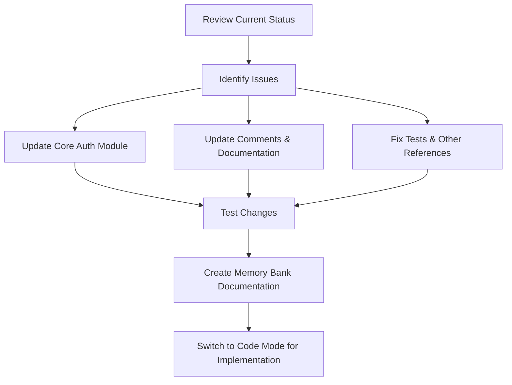

# Email-Only Authentication Implementation Plan

## Current Status
- A migration (e66712ccad45) has already been created to remove the username column from the users table
- The User model in app/models/user.py no longer has a username field
- Most code already uses email as the primary identifier
- The schemas, router, and services mostly reference email

## Issues Identified
1. The `app/core/auth.py` file still has references to username:
   - Line 29: Comment mentions username in the 'sub' claim
   - Line 60-61: Attempts to find user by username as fallback

2. There's a reference to a method `get_user_by_username()` in UserService that doesn't exist in the actual implementation

## Required Changes

### 1. Update Core Auth Module
- Remove username fallback code in `get_current_user` function
- Update comments to reflect email-only authentication

### 2. Update Documentation
- Update memory bank files to document this architectural change
- Create a new document explaining the email-only authentication system

### 3. Search for and Fix Any Other Username References
- Check for any other files that might reference username
- Update tests to ensure they're fully compatible with email-only authentication

## Implementation Plan Diagram



## Detailed Changes

### 1. Update Core Auth Module (`app/core/auth.py`)

```diff
- # Supports both email and username in the 'sub' claim for backward compatibility
+ # Uses email in the 'sub' claim for authentication

- # If not found, try to find by username (old tokens)
- if user is None:
-     user = await user_service.get_user_by_username(subject)
```

### 2. Create Documentation

Create a new file in memory-bank called `email_only_authentication.md` that documents:
- The rationale for switching to email-only authentication
- How the system now works (JWT tokens with email as subject)
- Migration considerations for any existing integrations

## Execution Plan

1. Update `app/core/auth.py` to remove username references
2. Create new documentation in memory-bank
3. Update memory-bank/activeContext.md to note this change
4. Switch to Code mode to implement these changes
5. Test the changes to ensure they work correctly