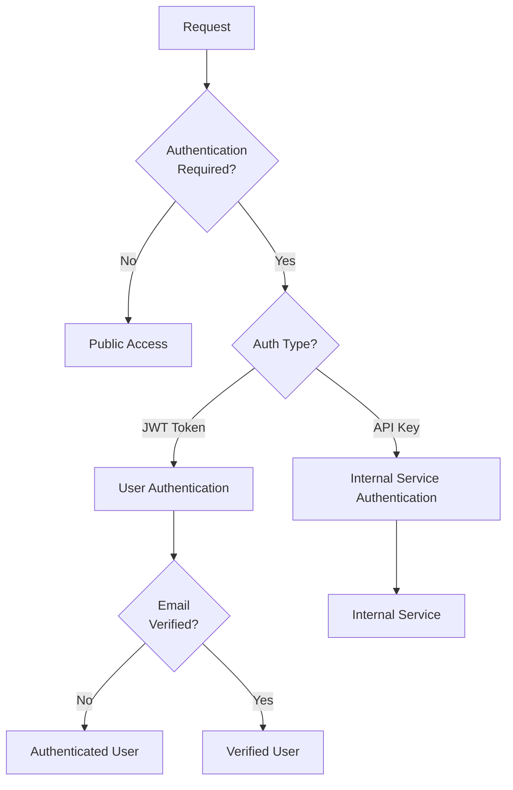
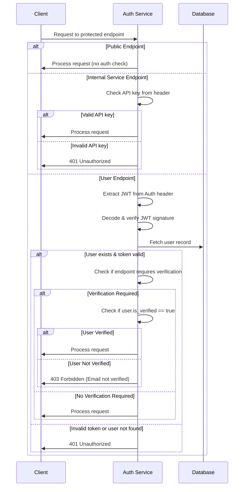
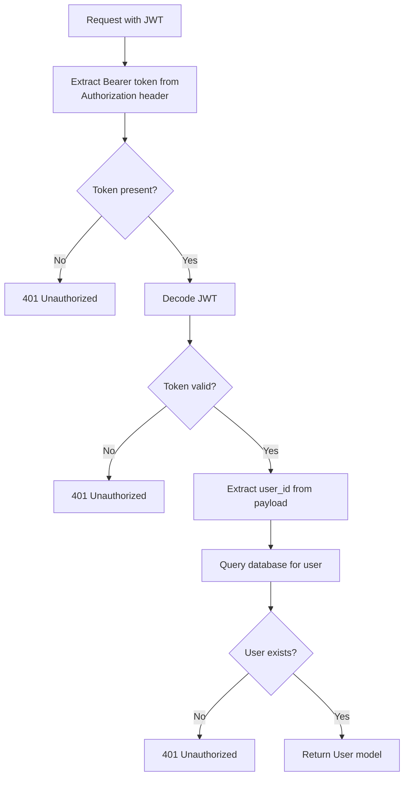
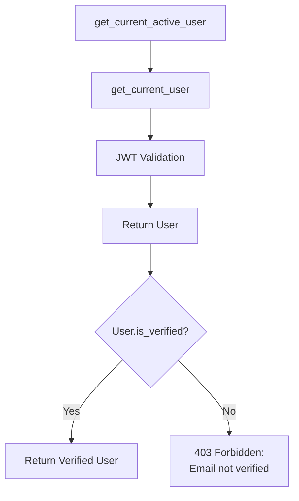
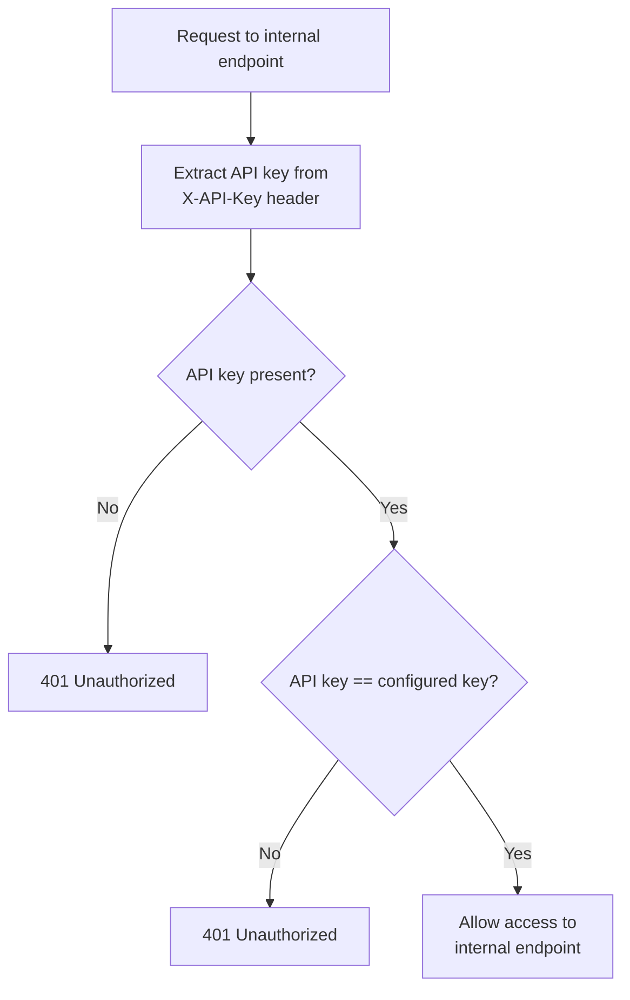

# Endpoint Security Documentation

## Security Classification System

The auth_service employs a multi-layered security approach to protect endpoints based on their requirements:

1. **Public Endpoints**: Open access to anyone, no authentication required
2. **Authenticated Endpoints**: Require valid JWT token (authentication)
3. **Verified User Endpoints**: Require valid JWT token AND email verification
4. **Internal Service Endpoints**: Require API key authentication, not accessible externally

## Security Enforcement Mechanisms

### Authentication Types



### Security Dependencies

- `get_current_user`: Validates JWT token, confirms user exists (authentication only)
- `get_current_active_user`: Validates JWT token, confirms user exists AND email is verified
- `get_internal_service`: Validates API key for internal service access

## Endpoint Security Classification

### Public Endpoints (No Auth Required)

```mermaid
graph LR
    A[Public Endpoints] --> B[/auth/login]
    A --> C[/auth/register]
    A --> D[/auth/verify-email]
    A --> E[/auth/resend-verification]
    A --> F[/auth/password-reset-request]
    A --> G[/auth/reset-password]
    A --> H[/auth/users/{user_id}/email]
    A --> I[/auth/users/by-email/{email}]
    A --> J[/auth/oauth/google/login]
    A --> K[/auth/oauth/google/callback]
    A --> L[/auth/test-email]
    A --> M[/auth/verify-email-templates]
```

### Authenticated Endpoints (JWT Token Required)

```mermaid
graph LR
    A[Authenticated Endpoints] --> B[/auth/refresh]
```

### Verified User Endpoints (JWT Token + Email Verification Required)

```mermaid
graph LR
    A[Verified User Endpoints] --> B[/auth/me]
    A --> C[/auth/logout]
    A --> D[/auth/users/change-password]
    A --> E[/auth/users/change-email]
    A --> F[/auth/users/delete-account]
    A --> G[/auth/link/google]
    A --> H[/auth/unlink/google]
```

### Internal Service Endpoints (API Key Required)

```mermaid
graph LR
    A[Internal Service Endpoints] --> B[/credits/balance]
    A --> C[/credits/add]
    A --> D[/credits/use]
    A --> E[/credits/transactions]
    A --> F[/stripe/webhook]
    A --> G[/stripe/create-checkout-session]
    A --> H[/stripe/setup-intent]
    A --> I[/stripe/payment-methods]
    A --> J[/stripe/create-subscription]
```

## Authentication Flow



## Authorization Implementation Details

### JWT Authentication Flow



### Email Verification Check



### Internal Service Authentication Flow



## Updated Security Implementation

### Endpoint Protection Changes

1. **Modified `/link/google` endpoint**:
   - Changed dependency from `get_current_user` to `get_current_active_user`
   - Added 403 error response documentation
   - Now requires email verification

2. **Modified `/unlink/google` endpoint**:
   - Changed dependency from `get_current_user` to `get_current_active_user`
   - Added 403 error response documentation
   - Now requires email verification

3. **Confirmed Credit Router Protection**:
   - All endpoints secured with `get_internal_service` dependency
   - Only accessible through internal service calls with valid API key

4. **Confirmed Stripe Webhook Router Protection**:
   - All endpoints secured with `get_internal_service` dependency
   - Only accessible through internal service calls with valid API key