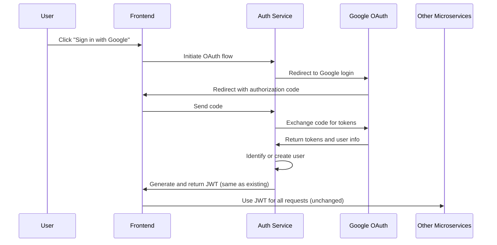

# Google OAuth 2.0 Integration Plan

## Overview

This document outlines the plan for implementing Google OAuth 2.0 authentication in the existing auth service while maintaining compatibility with the current JWT token system used across microservices.

## Current System Analysis

The current authentication system is a robust JWT-based solution with:

- Traditional username/email + password authentication
- Email verification workflow
- Password reset functionality
- JWT token management (creation, validation, refresh)
- User profile management (retrieval, update)

## Integration Goals

1. Add "Sign in with Google" option alongside existing authentication
2. Maintain compatibility with existing JWT token system
3. Support account linking (same user with multiple auth methods)
4. Preserve security and functionality of existing auth flows

## Architecture Approach



### Key Architecture Points

1. **OAuth for Authentication Only**:
   - Google OAuth is used solely for the initial user authentication (identity verification)
   - Once authentication is complete, your system generates its own JWT token

2. **No Changes to Existing JWT Handling**:
   - The JWT token structure remains the same
   - All microservices continue to validate JWT tokens as they do now
   - No changes needed in how other services consume the token

3. **Auth Service as OAuth Client**:
   - Your auth service acts as the OAuth client to Google
   - It handles the OAuth flow and token exchange
   - After validating the Google identity, it maps to your internal user

## Required Changes

### 1. Database Schema Updates

#### User Model Modifications

```python
# Modify the existing User model to add:
class User(Base):
    __tablename__ = "users"
    
    # Existing fields remain unchanged
    id = Column(Integer, primary_key=True, index=True)
    username = Column(String(50), unique=True, index=True, nullable=False)
    email = Column(String(100), unique=True, index=True, nullable=False)
    hashed_password = Column(String(255), nullable=True)  # Now nullable for OAuth users
    
    # New fields
    google_id = Column(String(255), nullable=True, unique=True)
    auth_type = Column(String(20), default="password")  # "password", "google", "both"
```

#### Migration Script

We'll need an Alembic migration script to:
- Make `hashed_password` nullable for OAuth-only users
- Add the `google_id` column
- Add the `auth_type` column

### 2. Configuration Updates

Add the following to `app/core/config.py`:

```python
# Google OAuth settings
GOOGLE_CLIENT_ID: str = os.getenv("GOOGLE_CLIENT_ID", "")
GOOGLE_CLIENT_SECRET: str = os.getenv("GOOGLE_CLIENT_SECRET", "")
GOOGLE_REDIRECT_URI: str = os.getenv("GOOGLE_REDIRECT_URI", "http://localhost:8000/auth/google/callback")
OAUTH_SCOPES: str = os.getenv("OAUTH_SCOPES", "openid email profile")

# Add validation function similar to validate_email_config
def validate_oauth_config() -> Tuple[bool, Dict[str, Any]]:
    """Validate OAuth configuration."""
    valid = True
    issues = []
    
    if not settings.GOOGLE_CLIENT_ID:
        issues.append("Google Client ID not configured (GOOGLE_CLIENT_ID)")
        valid = False
        
    if not settings.GOOGLE_CLIENT_SECRET:
        issues.append("Google Client Secret not configured (GOOGLE_CLIENT_SECRET)")
        valid = False
        
    if not settings.GOOGLE_REDIRECT_URI:
        issues.append("Google Redirect URI not configured (GOOGLE_REDIRECT_URI)")
        valid = False
    
    return valid, {
        "valid": valid,
        "issues": issues
    }
```

### 3. New Authentication Schemas

Add these schemas to `app/schemas/auth_schemas.py`:

```python
class GoogleAuthRequest(BaseModel):
    """Request to initiate Google OAuth flow."""
    redirect_uri: Optional[str] = None
    
    model_config = ConfigDict(from_attributes=True)

class GoogleAuthCallback(BaseModel):
    """Callback from Google OAuth."""
    code: str
    state: Optional[str] = None
    
    model_config = ConfigDict(from_attributes=True)

class OAuthProfile(BaseModel):
    """OAuth provider user profile."""
    provider: str
    provider_user_id: str
    email: EmailStr
    name: Optional[str] = None
    picture: Optional[str] = None
    
    model_config = ConfigDict(from_attributes=True)

class AccountLinkRequest(BaseModel):
    """Request to link OAuth account to existing user."""
    provider: str
    code: str
    password: str
    
    model_config = ConfigDict(from_attributes=True)
```

### 4. OAuth Service Implementation

Create a new file `app/services/oauth_service.py`:

```python
"""Service for OAuth authentication."""

from typing import Dict, Any, Optional, Tuple
import httpx
from fastapi import HTTPException, status, BackgroundTasks
from sqlalchemy import select
from sqlalchemy.ext.asyncio import AsyncSession

from app.core.config import settings
from app.models.user import User
from app.services.user_service import UserService
from app.log.logging import logger

class GoogleOAuthService:
    """Service for Google OAuth authentication."""
    
    def __init__(self, db: AsyncSession):
        """Initialize with database session."""
        self.db = db
        self.user_service = UserService(db)
        
    async def get_authorization_url(self, redirect_uri: Optional[str] = None) -> str:
        """Get Google authorization URL."""
        oauth_redirect = redirect_uri or settings.GOOGLE_REDIRECT_URI
        
        # Build authorization URL
        params = {
            'client_id': settings.GOOGLE_CLIENT_ID,
            'redirect_uri': oauth_redirect,
            'scope': settings.OAUTH_SCOPES,
            'response_type': 'code',
            'access_type': 'offline',
            'prompt': 'consent'
        }
        
        # Construct URL with parameters
        base_url = "https://accounts.google.com/o/oauth2/auth"
        query_string = "&".join([f"{k}={v}" for k, v in params.items()])
        
        return f"{base_url}?{query_string}"
    
    async def exchange_code_for_tokens(self, code: str, redirect_uri: Optional[str] = None) -> Dict[str, Any]:
        """Exchange authorization code for access and refresh tokens."""
        oauth_redirect = redirect_uri or settings.GOOGLE_REDIRECT_URI
        
        # Prepare token request
        token_url = "https://oauth2.googleapis.com/token"
        data = {
            'client_id': settings.GOOGLE_CLIENT_ID,
            'client_secret': settings.GOOGLE_CLIENT_SECRET,
            'code': code,
            'redirect_uri': oauth_redirect,
            'grant_type': 'authorization_code'
        }
        
        # Make token request
        async with httpx.AsyncClient() as client:
            response = await client.post(token_url, data=data)
            
        # Check for errors
        if response.status_code != 200:
            logger.error(
                "Failed to exchange code for tokens",
                event_type="oauth_token_exchange_error",
                status_code=response.status_code,
                response=response.text
            )
            raise HTTPException(
                status_code=status.HTTP_400_BAD_REQUEST,
                detail="Failed to authenticate with Google"
            )
            
        # Return tokens
        tokens = response.json()
        return tokens
    
    async def get_user_profile(self, access_token: str) -> Dict[str, Any]:
        """Get user profile from Google using access token."""
        userinfo_url = "https://www.googleapis.com/oauth2/v3/userinfo"
        headers = {'Authorization': f'Bearer {access_token}'}
        
        # Make userinfo request
        async with httpx.AsyncClient() as client:
            response = await client.get(userinfo_url, headers=headers)
            
        # Check for errors
        if response.status_code != 200:
            logger.error(
                "Failed to get user profile",
                event_type="oauth_userinfo_error",
                status_code=response.status_code,
                response=response.text
            )
            raise HTTPException(
                status_code=status.HTTP_400_BAD_REQUEST,
                detail="Failed to get user information from Google"
            )
            
        # Return user profile
        profile = response.json()
        return profile
    
    async def find_or_create_user(self, profile: Dict[str, Any]) -> User:
        """Find existing user or create a new one from Google profile."""
        # Try to find user by Google ID
        result = await self.db.execute(
            select(User).where(User.google_id == profile.get('sub'))
        )
        user = result.scalar_one_or_none()
        
        if user:
            # Found existing user with this Google ID
            return user
            
        # Try to find user by email
        result = await self.db.execute(
            select(User).where(User.email == profile.get('email'))
        )
        user = result.scalar_one_or_none()
        
        if user:
            # Found user with same email - update with Google ID
            user.google_id = profile.get('sub')
            user.auth_type = 'both' if user.hashed_password else 'google'
            
            # If email wasn't verified before, verify it now (Google verifies emails)
            if not user.is_verified:
                user.is_verified = True
                
            await self.db.commit()
            await self.db.refresh(user)
            return user
            
        # Create new user from Google profile
        username = self._generate_username_from_email(profile.get('email'))
        
        new_user = User(
            username=username,
            email=profile.get('email'),
            google_id=profile.get('sub'),
            auth_type='google',
            is_verified=True,  # Google already verified the email
            hashed_password=None  # No password for OAuth users
        )
        
        self.db.add(new_user)
        await self.db.commit()
        await self.db.refresh(new_user)
        
        logger.info(
            "Created new user from Google OAuth",
            event_type="oauth_user_created",
            username=username,
            email=profile.get('email')
        )
        
        return new_user
    
    def _generate_username_from_email(self, email: str) -> str:
        """Generate a username from an email address."""
        # Simple implementation - use everything before the @
        username_base = email.split('@')[0]
        
        # Add random digits for uniqueness
        import random
        random_digits = ''.join([str(random.randint(0, 9)) for _ in range(4)])
        
        return f"{username_base}_{random_digits}"
    
    async def link_google_account(self, user: User, profile: Dict[str, Any]) -> User:
        """Link Google account to existing user."""
        user.google_id = profile.get('sub')
        user.auth_type = 'both'
        
        await self.db.commit()
        await self.db.refresh(user)
        
        logger.info(
            "Linked Google account to existing user",
            event_type="oauth_account_linked",
            user_id=user.id,
            username=user.username,
            google_id=profile.get('sub')
        )
        
        return user
        
    async def unlink_google_account(self, user: User) -> User:
        """Unlink Google account from user."""
        # Ensure user has a password before unlinking
        if not user.hashed_password:
            raise HTTPException(
                status_code=status.HTTP_400_BAD_REQUEST,
                detail="Cannot unlink Google account without setting a password first"
            )
            
        user.google_id = None
        user.auth_type = 'password'
        
        await self.db.commit()
        await self.db.refresh(user)
        
        logger.info(
            "Unlinked Google account from user",
            event_type="oauth_account_unlinked",
            user_id=user.id,
            username=user.username
        )
        
        return user
```

### 5. Router Implementation

Add these endpoints to `app/routers/auth_router.py`:

```python
# Import the service
from app.services.oauth_service import GoogleOAuthService

# Add new endpoints
@router.get(
    "/oauth/google/login",
    response_model=Dict[str, str],
    responses={
        200: {"description": "Google login URL generated"},
        500: {"description": "Failed to generate login URL"}
    }
)
async def google_login(
    redirect_uri: Optional[str] = None,
    db: AsyncSession = Depends(get_db)
) -> Dict[str, str]:
    """
    Generate Google OAuth login URL.
    
    Args:
        redirect_uri: Optional custom redirect URI
        db: Database session
        
    Returns:
        Dict with login URL
    """
    try:
        oauth_service = GoogleOAuthService(db)
        auth_url = await oauth_service.get_authorization_url(redirect_uri)
        
        logger.info(
            "Generated Google OAuth URL",
            event_type="oauth_url_generated",
            redirect_uri=redirect_uri or settings.GOOGLE_REDIRECT_URI
        )
        
        return {"auth_url": auth_url}
    
    except Exception as e:
        logger.error(
            "Failed to generate Google OAuth URL",
            event_type="oauth_url_error",
            error=str(e),
            error_type=type(e).__name__
        )
        raise HTTPException(
            status_code=status.HTTP_500_INTERNAL_SERVER_ERROR,
            detail=f"Error generating Google login URL: {str(e)}"
        )

@router.post(
    "/oauth/google/callback",
    response_model=Token,
    responses={
        200: {"description": "Successfully authenticated with Google"},
        400: {"description": "Invalid OAuth callback"}
    }
)
async def google_callback(
    callback: GoogleAuthCallback,
    db: AsyncSession = Depends(get_db)
) -> Token:
    """
    Process Google OAuth callback and generate JWT token.
    
    Args:
        callback: Callback data with authorization code
        db: Database session
        
    Returns:
        JWT token same as regular login
    """
    try:
        oauth_service = GoogleOAuthService(db)
        
        # Exchange code for tokens
        tokens = await oauth_service.exchange_code_for_tokens(callback.code)
        
        # Get user profile
        profile = await oauth_service.get_user_profile(tokens['access_token'])
        
        # Find or create user
        user = await oauth_service.find_or_create_user(profile)
        
        # Generate JWT token (same as regular login)
        expires_delta = timedelta(minutes=60)
        expire_time = datetime.now(timezone.utc) + expires_delta
        
        # Use email as the subject for new tokens (same as existing system)
        access_token = create_access_token(
            data={
                "sub": user.email,
                "id": user.id,
                "is_admin": user.is_admin,
                "exp": expire_time.timestamp()
            },
            expires_delta=expires_delta
        )
        
        logger.info(
            "Google OAuth login successful",
            event_type="oauth_login_success",
            user_id=user.id,
            username=user.username,
            email=user.email
        )
        
        return Token(access_token=access_token, token_type="bearer")
        
    except HTTPException as http_ex:
        # Re-raise HTTP exceptions
        raise http_ex
    except Exception as e:
        logger.error(
            "Google OAuth callback error",
            event_type="oauth_callback_error",
            error=str(e),
            error_type=type(e).__name__
        )
        raise HTTPException(
            status_code=status.HTTP_400_BAD_REQUEST,
            detail=f"Error processing Google callback: {str(e)}"
        )

@router.post(
    "/link/google",
    response_model=Dict[str, str],
    responses={
        200: {"description": "Google account linked successfully"},
        401: {"description": "Not authenticated or invalid password"},
        400: {"description": "Invalid OAuth callback"}
    }
)
async def link_google_account(
    link_request: AccountLinkRequest,
    current_user: User = Depends(get_current_user),
    db: AsyncSession = Depends(get_db)
) -> Dict[str, str]:
    """
    Link Google account to existing user.
    
    Args:
        link_request: Link request with Google auth code and password
        current_user: Current authenticated user
        db: Database session
        
    Returns:
        Success message
    """
    try:
        # Verify password
        user_service = UserService(db)
        if not verify_password(link_request.password, current_user.hashed_password):
            raise HTTPException(
                status_code=status.HTTP_401_UNAUTHORIZED,
                detail="Invalid password"
            )
            
        oauth_service = GoogleOAuthService(db)
        
        # Exchange code for tokens
        tokens = await oauth_service.exchange_code_for_tokens(link_request.code)
        
        # Get user profile
        profile = await oauth_service.get_user_profile(tokens['access_token'])
        
        # Link account
        await oauth_service.link_google_account(current_user, profile)
        
        return {"message": "Google account linked successfully"}
        
    except HTTPException as http_ex:
        # Re-raise HTTP exceptions
        raise http_ex
    except Exception as e:
        logger.error(
            "Google account linking error",
            event_type="oauth_link_error",
            user_id=current_user.id,
            username=current_user.username,
            error=str(e),
            error_type=type(e).__name__
        )
        raise HTTPException(
            status_code=status.HTTP_400_BAD_REQUEST,
            detail=f"Error linking Google account: {str(e)}"
        )

@router.post(
    "/unlink/google",
    response_model=Dict[str, str],
    responses={
        200: {"description": "Google account unlinked successfully"},
        400: {"description": "Cannot unlink account without password"},
        401: {"description": "Not authenticated"}
    }
)
async def unlink_google_account(
    current_user: User = Depends(get_current_user),
    db: AsyncSession = Depends(get_db)
) -> Dict[str, str]:
    """
    Unlink Google account from user.
    
    Args:
        current_user: Current authenticated user
        db: Database session
        
    Returns:
        Success message
    """
    try:
        oauth_service = GoogleOAuthService(db)
        await oauth_service.unlink_google_account(current_user)
        
        return {"message": "Google account unlinked successfully"}
        
    except HTTPException as http_ex:
        # Re-raise HTTP exceptions
        raise http_ex
    except Exception as e:
        logger.error(
            "Google account unlinking error",
            event_type="oauth_unlink_error",
            user_id=current_user.id,
            username=current_user.username,
            error=str(e),
            error_type=type(e).__name__
        )
        raise HTTPException(
            status_code=status.HTTP_400_BAD_REQUEST,
            detail=f"Error unlinking Google account: {str(e)}"
        )
```

## Dependencies and Requirements

Add these packages to your requirements:

```
httpx>=0.23.0  # Async HTTP client
```

## Compatibility with Existing Systems

The implementation maintains full compatibility with your existing microservices architecture because:

1. **Same JWT Token Format**: The JWT token generated after OAuth authentication is identical in structure to your current JWT tokens

2. **No Changes to Token Validation**: Other services continue to validate JWT tokens as they do now

3. **Transparent Authentication**: The underlying authentication method (password vs OAuth) is abstracted away from other services

## Implementation Steps

1. **Update User Model and Create Migration**:
   - Add Google-specific fields to User model
   - Create Alembic migration

2. **Configuration and Environment Variables**:
   - Add Google OAuth configuration to settings
   - Add environment variables for Google credentials

3. **Implement OAuth Service**:
   - Create Google OAuth service with necessary methods
   - Implement user profile mapping and token exchange

4. **Add Router Endpoints**:
   - Implement OAuth flow endpoints in auth_router
   - Add account linking endpoints

5. **Update Dependencies**:
   - Add httpx package for async HTTP requests

6. **Testing**:
   - Test OAuth flow
   - Test account linking
   - Test JWT token generation and validation

7. **Frontend Integration**:
   - Add "Sign in with Google" button
   - Implement OAuth flow on frontend
   - Handle callback and token storage

## OAuth Libraries

For this implementation, we recommend:

1. **httpx**: Asynchronous HTTP client for API requests to Google
   - Compatible with FastAPI's async approach
   - Simple API for handling OAuth token exchanges

2. **Your existing JWT libraries**: Continue using your current JWT implementation

Note that we don't need a full OAuth client library since we're implementing a focused OAuth client specifically for Google authentication.